# Onkos

**A curated, citation-backed, tier-annotated dataset of tumor-growth-inhibition
(TGI) models, exposure-response links, and TGI-metric → survival models — the
machinery oncology drug development runs on — exported into the standard
pharmacometric and systems-biology formats (NONMEM, SBML, PharmML,
nlmixr2/rxode2, Pumas).**

> ⚠️ **NOT a clinical decision tool. NOT a prognostic calculator. NOT a
> treatment recommender.** Population/trial-level forward simulation only, for
> drug-development methodology, simulation, and education. Every export carries
> `onkos:clinicalUse = "PROHIBITED — research / drug-development / education only"`.

*Onkos* (Greek *ὄγκος*, "mass, swelling") is the literal root of *onco-*. It is
the third in a family with **Nidus** (gestational physiology) and **Hypnos**
(anesthetic PK/PD), sharing one thesis: **a model is only as trustworthy as its
weakest, least-validated input — so make that a first-class, machine-readable
field.**

[](https://github.com/clay-good/onkos/actions/workflows/ci.yml)
&nbsp;v0.19 · Code: MIT · Data: CC-BY-4.0 · Python ≥ 3.9

---

## The problem

Oncology has the highest drug attrition of any therapeutic area, and the field's
response is model-informed drug development: link drug exposure to tumor-size
dynamics, and tumor dynamics to overall survival (OS), so early data forecast
late outcomes and gate go/no-go decisions. The workhorse models (Gompertz,
Simeoni, **Claret**, Stein/Bruno growth-rate-constant) live in per-drug,
per-trial papers, carry enormous and under-communicated uncertainty (resistance
terms with ~90% CV are routine), and are **derived in one context then silently
transported to another**, where their predictive validity is unknown.

Onkos is the missing curated layer: it says, honestly, *which TGI model and which
parameters, for which tumor type and line, derived from which trial, validated
how far beyond it, with what confidence — and how much the survival prediction
changes if you'd picked a different model.*

---

## The headline feature: virtual-trial divergence

Pick a tumor type, line, and drug-effect size. Onkos overlays the simulated
tumor-size and **population OS** curves across *every eligible TGI model*, greys
out the models whose `transportability` envelope the context violates (with the
reason), and quantifies the divergence in the survival prediction. **This makes
model-selection risk in go/no-go decisions measurable** — the exact risk that,
unquantified, sends drugs into doomed phase-3 trials.


In the figure above (NSCLC, first line, E = 1.0), two NSCLC-validated models that
fit early tumor data comparably imply median OS anywhere from ~54 to ~94 weeks.
Every model validated only on another tumor type is **greyed out automatically**
because applying it to NSCLC leaves its validated envelope (tier → D + warning).
That spread *is* the model-selection risk.

```text
$ onkos simulate --compare --tumor-type NSCLC --line first --drug-effect 1.0

  [C] drug_effect.norton_simon.nsclc                median OS   58.0
  [C] resistance.claret_2009.tgi                    median OS   90.8  PFS   35.1
  [C] resistance.nsclc_first_line.two_population    median OS   94.5
  [C] tgi_metrics.wang_2009.biexponential           median OS   53.7  PFS   20.9
  [-] resistance.crc_first_line.claret              EXCLUDED
        (tumor_type 'NSCLC' is outside validated ['CRC'] -> tier_down_to_D and warn)
  [-] ... 8 more excluded for out-of-context transport (breast, HCC, melanoma, 2L)

  OS  divergence 0.265  | median OS range  (53.7, 94.5)
  PFS divergence 0.242  | median PFS range (20.9, 36.5)
```

### The second uncertainty axis: parameter variability

The divergence view quantifies *model-selection* uncertainty. The other axis is
*parameter* uncertainty: the dataset records inter-individual variability
(`iiv_cv_percent`) on its high-uncertainty kill/resistance terms specifically so
they cannot pose as point estimates — and `onkos.simulate_ensemble` makes that
stored variability flow into the prediction. Parameters with an IIV CV are
sampled lognormally (the standard pharmacometric convention; the median is
preserved) and the tumor-size, TGI-metric, and population-OS distributions are
returned as bands.

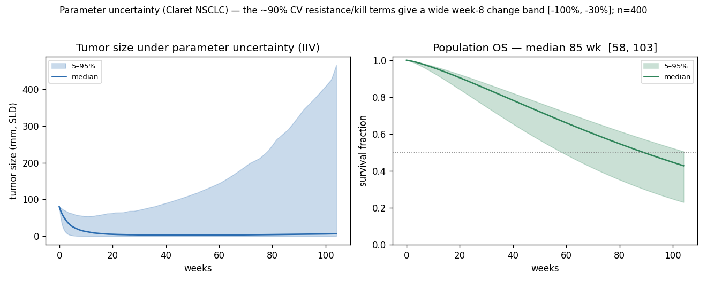

For the Claret NSCLC model, whose resistance and kill terms carry ~90% CV, this
turns a deceptively precise "80% week-8 shrinkage" into an honest
`[-100%, -30%]` band and a median-OS interval of roughly 58–103 weeks — the
uncertainty was always in the data; now it is in the answer.

### Model averaging: parameter noise vs irreducible model-choice risk

The divergence view shows *that* the eligible models disagree; `onkos.combine` is
its inferential completion. It splits the total uncertainty of a composed survival
forecast into the two axes above using the **law of total variance**:

```text
Var(Q)  =  Σ wₘ·Var(Q|m)        +   Σ wₘ·(E[Q|m] − Q̄)²
        =  WITHIN (parameter)    +   BETWEEN (model-selection)

model_selection_fraction  =  BETWEEN / (WITHIN + BETWEEN)   ∈ [0, 1]
```

That fraction answers the question a go/no-go committee actually has: *of
everything I am uncertain about in this forecast, how much would shrink if I ran a
bigger trial and nailed the parameters (within), versus how much is structural
disagreement between equally-published models that more data on any one of them
will not resolve (between)?* A high between-fraction is precisely the signal that
sends programs into doomed phase-3 trials — and it has never had a number.

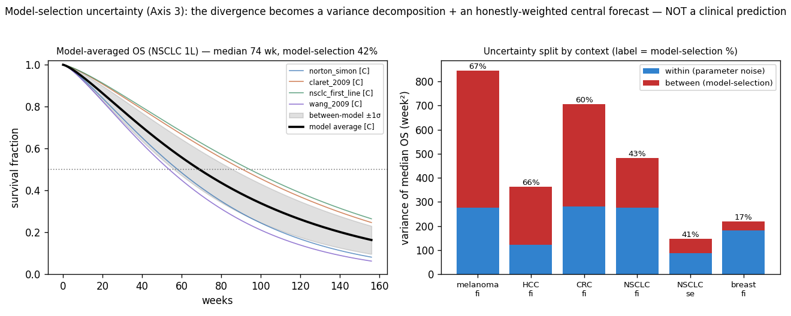

The eligible models also combine into a single model-averaged OS/PFS curve `S̄(t)`
(a convex combination of monotone survival curves is itself a valid survival
curve) carrying its **between-model band** — the average never ships without the
disagreement that qualifies it. Per context, the between-fraction ranks where
adding a better-validated TGI model has the most value (model-level curation
triage), and `onkos report` prints exactly that ranking.

```text
$ onkos compare --average --weights equal --decompose

  Model-averaged median_os_weeks = 71.6  [OS, scheme=equal, tier=C]
  Variance: within(parameter)=229.1  between(model-selection)=207.2
  >> model_selection_fraction = 0.47   (irreducible model-choice risk)

  scheme        point    within   between   frac
  equal          71.6     229.1     207.2   0.47
  tier           71.6     229.1     207.2   0.47
  evidence       70.5     217.3     209.5   0.49
  weight_sensitivity (point swing across schemes) = 1.08
```

```python
ma = cmp.model_average(target="median_os_weeks", endpoint="OS", weights="equal")
ma.point, ma.tier               # averaged median OS; worst included tier (cannot be raised)
ma.within_var, ma.between_var   # the law-of-total-variance components
ma.model_selection_fraction     # BETWEEN / TOTAL — the headline number
ma.curve, ma.between_band       # S̄(t) and its pointwise between-model ±1σ
ma.weights                      # {record_id: wₘ}  (combination weights, NOT posteriors)
ma.weight_sensitivity, ma.warnings
```

**The honesty boundary.** Classical Bayesian model averaging weights models by
`P(model | data)`, and stacking optimizes predictive weights — *both require the
candidates to share one dataset*. Onkos models are fit to **different** trials,
drugs, and tumor types, so a posterior model probability is **not identifiable**
and would be a fabricated quantity. Onkos therefore frames its weights as
**forecast-combination weights** (Bates–Granger 1969), explicitly *not* posterior
probabilities, and prints that distinction wherever weights appear. Three declared
schemes ship — `equal` (the agnostic default), `tier` (A:B:C = 4:2:1, a *declared*
not fitted factor), and `evidence` (∝ external C-index − 0.5) — and the headline
target is always reported under all of them, with the cross-scheme swing
(`weight_sensitivity`) flagged when the central estimate is weight-fragile.
Averaging **cannot raise a tier**, never rehabilitates an excluded out-of-context
model, and a single-eligible-model context returns `fraction = 0` *with* a warning
(a zero is an absence of cross-checks, not a clean bill of health). The method has
direct regulatory-science precedent in dose-finding — MCP-Mod (Bretz, Pinheiro &
Branson 2005) and NLME model averaging (Buatois et al. 2018); Onkos's TGI-survival
combiner is the same idea one layer up. The combination math is proven against a
landmark suite (`tests/test_combine.py`) the way the kernels are: the estimator
*is* the law of total variance and a convex forecast combination, not a curve fit.

### TGI metrics — the Stein/Bruno panel

Every simulated trajectory is summarized into the derived metrics oncology
pharmacometrics actually reports (spec §3, §6): depth of response, nadir and
**time-to-growth**, the **tumor growth-rate constant k_g** (the strongly
prognostic Stein/Bruno quantity), the shrinkage-rate constant k_s, and the
RECIST-style **duration of response** (partial response → progression). They feed
both the survival link (via the week-8 change) and the reports.

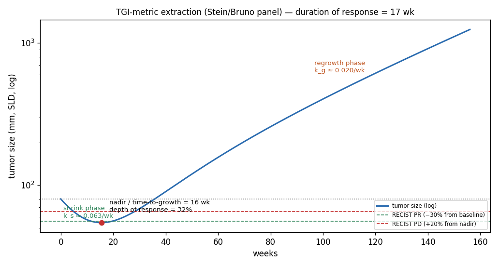

The extractor is **model-agnostic** — it estimates k_g / k_s from the trajectory
the way the Stein method estimates them from RECIST data, so the metrics are
comparable across the Claret, biexponential, and Simeoni kernels. It is also
self-checking: run on the biexponential kernel it recovers that kernel's
*generating* k_g and k_s to within ~10%, and on the Claret model the extracted
k_g recovers the model's growth constant k_L. Metrics that don't apply (no
regrowth, no RECIST response) are returned as `nan`, never fabricated.

```python
m = onkos.simulate(ds, "tgi_metrics.wang_2009.biexponential", context=ctx).metrics
m["tumor_growth_rate_kg"]       # late-phase log-linear regrowth rate (≈ generating kg)
m["tumor_shrinkage_rate_ks"]    # initial shrink rate via k_s = k_g − s0
m["time_to_growth_weeks"]       # nadir time when genuine regrowth follows
m["duration_of_response_weeks"] # RECIST PR (−30%) → PD (+20% from nadir); nan if no PR
```

### Which uncertainty to verify first: sensitivity analysis

Propagation gives a band; `onkos.sensitivity` attributes that band's variance to
individual parameters. Because each IIV-bearing parameter is sampled
independently, a parameter's standardized regression coefficient equals its
correlation with the target and the squared coefficients partition the explained
variance (a first-order Sobol decomposition). This is **curation triage**: the
spec's highest-leverage contribution is verifying records against the source PDF
(§9), and this says *which* parameter's uncertainty actually moves the survival
prediction.

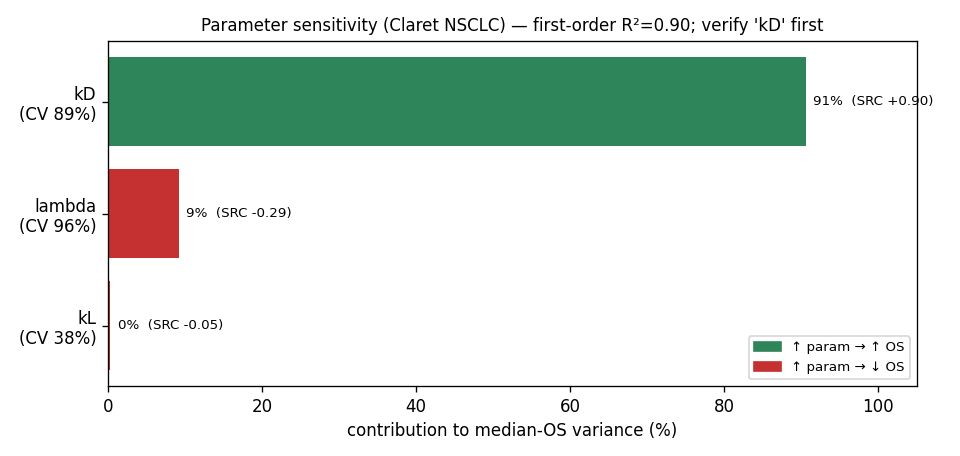

A genuinely useful nuance falls out: for the Claret NSCLC model the kill rate
`kD` (CV 89%) drives ~90% of the median-OS variance — *more* than the resistance
term `lambda` (CV 96%), because influence is variability × effect-strength, not
CV alone. So `kD` is where verification pays off first.

```python
res = onkos.sensitivity(ds, "resistance.claret_2009.tgi", context=ctx, target="median_os_weeks")
res.r_squared                  # first-order variance explained
res.dominant.symbol            # "kD" — verify this parameter first
[(p.symbol, round(p.contribution, 2), p.src) for p in res.indices]
```

### Could a trial even estimate this parameter? Practical identifiability

Sensitivity asks *which* uncertainty drives the forecast; `onkos.identify` asks the
prior question — was the uncertainty ever *resolvable* by the trial that reported
it? The dataset's defining honesty move is surfacing the ~90% CV on kill/resistance
terms, with the stated reason that *resistance is poorly identifiable from short
trials*. This module measures that claim instead of asserting it. Given a model and
a realistic RECIST scan schedule, it builds the **Fisher information of the design**
and returns the **Cramér–Rao** lower bound on each parameter's precision — the best
relative standard error (RSE) any estimator could achieve from data of that shape.

```text
Sᵢⱼ = ∂f(tᵢ)/∂θⱼ        M = SᵀWS,  W = diag(1/σᵢ²)        (the design FIM)
RSEⱼ = √(M⁻¹)ⱼⱼ / |θⱼ|    γ_K = 1 / √(λ_min of the column-normalized SᵀWS)
practically_identifiable = (maxⱼ RSEⱼ < 50%) AND (γ_K < 15)
```

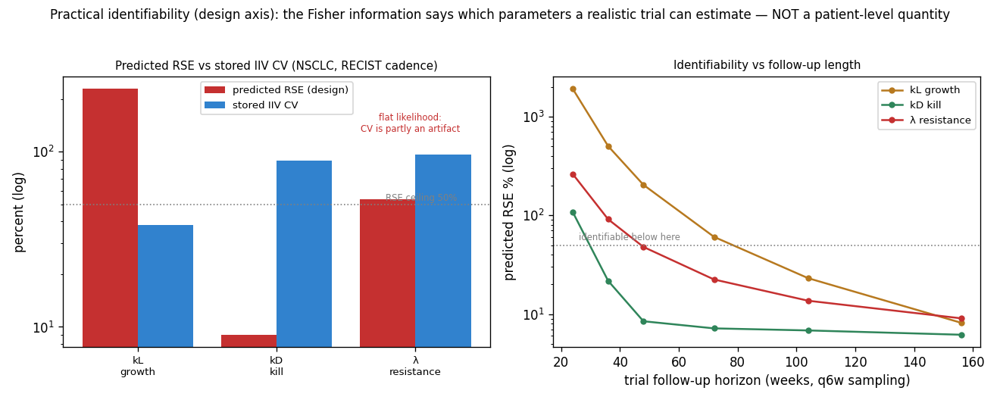

The payload is the **stored IIV CV next to the predicted RSE**. For the Claret NSCLC
model under a realistic cadence, the kill rate `kD` is well identified (RSE ≈ 9%, its
early-shrinkage signal is strong), but the growth rate `kL` and the resistance decay
`lambda` are flat (RSE ≈ 229% and 53%) and confounded (collinearity index γ_K ≈ 22).
So `lambda`'s 96% CV is, at least in part, a **flat-likelihood artifact** of the
originating design — not a clean estimate of biological spread — and Onkos says so
with a `cv_is_identifiability_artifact` flag. Identifiability is a property of the
*design*: lengthen the follow-up past resistance-driven regrowth (right panel) and
`lambda` finally drops below the ceiling, while `kL` (growth, masked by treatment)
stays the hardest to pin down. Across the dataset the verdict bifurcates cleanly —
the parsimonious 2-parameter biexponential (Stein/Bruno) models are identifiable;
every 3-parameter resistance-augmented model is not — and `onkos report` ranks the
models whose estimates a realistic trial cannot support (design-level curation
triage).

```python
res = onkos.identifiability(ds, "resistance.claret_2009.tgi", context=ctx,
                            schedule=[0, 6, 12, 18, 24, 36, 48])   # weeks
res.practically_identifiable   # False — under this design
res.collinearity_index         # γ_K ≈ 22  (a confounded parameter combination)
res.worst.symbol               # "kL" — needs a richer design / external constraint first
[(p.symbol, round(p.rse_percent), p.iiv_cv_percent) for p in res.params]
res.tier                       # unchanged — identifiability cannot move a tier
```

A diagnostic *about* a model under a design, never about a patient and never a
tier-mover: a singular design reports `inf` (honest) rather than a fabricated bound,
and "unidentifiable" always means *under this schedule and residual-error model*. It
is the individual (fixed-effects) design FIM — the standard local practical-
identifiability tool of pharmacometric optimal design (PFIM/PopED; the structural-vs-
practical distinction of Raue et al. 2009; the collinearity index of Brun et al.
2001). The information algebra is proven against a landmark suite
(`tests/test_identifiability.py`): the analyzer *is* the Cramér–Rao bound and the
Brun collinearity index — exponential closed form, information additivity, monotonic
precision, residual-error scaling, and singular-design honesty — not a precision
guess.

```text
$ onkos identify resistance.claret_2009.tgi

  parameter       central  pred. RSE   IIV CV   identifiable?
  kL                0.021       229%      38%   NO
  lambda            0.061        53%      96%   NO
  kD                  0.3         9%      89%   yes

  collinearity index γ_K = 22.3  (ceiling 15)  ->  NOT identifiable under this design
  ! cv_is_identifiability_artifact: 'lambda' carries IIV CV 96% and is practically
    unidentifiable (RSE 53%) — its variability is partly a flat-likelihood artifact
```

### Two survival endpoints: OS and PFS

The spec (§2, §6) calls for both **overall survival (OS)** and **progression-free
survival (PFS)**. Each tumor context carries an OS link and a PFS link (parametric
Weibull-PH on the week-8 TGI metric), so a simulation returns a curve per
endpoint and PFS is shorter than OS by construction. Every analysis — the
divergence view, uncertainty bands, and sensitivity (`target="median_pfs_weeks"`)
— works on either endpoint.

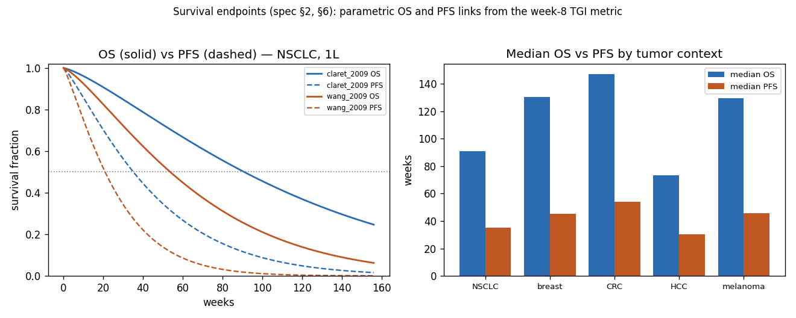

```python
tr = onkos.simulate(ds, "resistance.claret_2009.tgi", context=ctx, drug_effect=1.0)
tr.survival                    # {"OS": curve, "PFS": curve}
tr.median_os, tr.median_pfs    # e.g. 90.8, 35.1 weeks  (PFS < OS)
```

### A third axis: survival-model choice (parametric vs Cox)

The spec (§2, §6) asks for **Cox** as well as parametric links. The Cox
proportional-hazards form uses a *nonparametric* tabulated baseline survival
`S0(t)` (from data, not a closed-form distribution): `S(t | x) = S0(t)^exp(β·x)`.
It is marked **non-default**, so it never auto-collides with the Weibull link on
the same endpoint — you opt in with `survival_link=` to ask a different question:
*how much does the choice of survival model itself move the answer?*

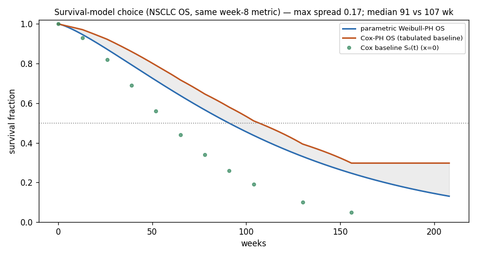

For NSCLC OS, the same week-8 TGI metric fed through the parametric Weibull link
versus the Cox link shifts median OS from ~91 to ~107 weeks — a third uncertainty
axis (survival-model structure) alongside model-selection divergence and
parameter variability.

```python
cox = onkos.simulate(ds, "resistance.claret_2009.tgi", context=ctx,
                     survival_link="survival_link.nsclc_os_cox")
```

### Line of therapy — and line-aware survival matching

The context library is indexed by tumor type **and line of therapy**. NSCLC now
carries a first-line *and* a second-line context (baseline, OS + PFS links,
eligible TGI models), and survival matching is **line-aware**: a second-line
simulation never silently borrows a first-line survival model. Second-line
prognosis is shorter, the first-line-only Claret model is correctly excluded from
the 2L view, and a line with no curated link gets *no* survival curve rather than
a wrong one.

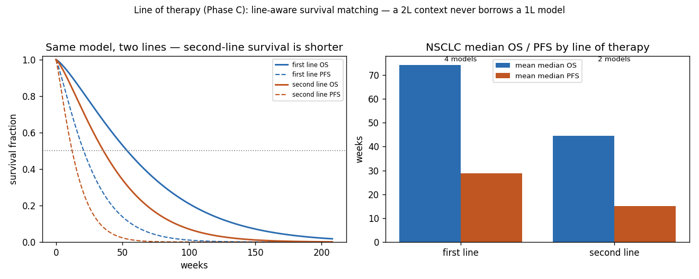

```python
first  = onkos.simulate(ds, "tgi_metrics.wang_2009.biexponential", context=dict(tumor_type="NSCLC", line="first"))
second = onkos.simulate(ds, "tgi_metrics.wang_2009.biexponential", context=dict(tumor_type="NSCLC", line="second"))
second.median_os < first.median_os          # True — same model, line-aware survival
```

> Fix shipped here: survival-link discovery previously matched only on tumor type,
> so a second-line context silently reused first-line survival models. It now
> matches on `(tumor_type, line)`.

### The full chain: PK → exposure → tumor dynamics → survival

Onkos *consumes* exposure; it does not model PK (that is its sibling **Hypnos**).
The small `onkos.pk` bridge turns a dose/regimen — or an external Hypnos PK
profile — into the exposure metric the ER kernels expect, so the spec's headline
composability claim runs **self-contained**: dose → `C_avg` → exposure-response →
kill → tumor dynamics → OS/PFS, one open, tier-annotated chain. The PK generators
are illustrative (the cornerstone relation `C_avg = F·Dose/(CL·τ)`); for real PK,
fit/simulate in Hypnos and feed the profile via `pk.from_profile`.

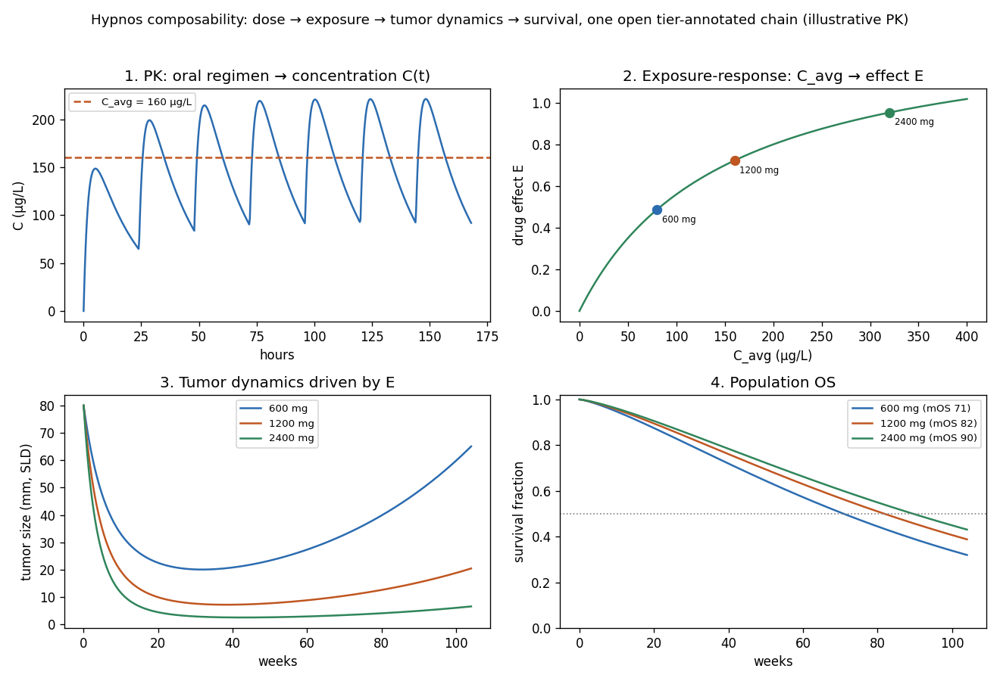

```python
from onkos import pk
c_avg = pk.steady_state_metrics(dose=1200, tau=24, ka=0.5, ke=0.05, v=5)["c_avg"]
tr = onkos.simulate(ds, "resistance.claret_2009.tgi", context=ctx,
                    exposure=c_avg, exposure_response="exposure_response.emax_generic")
# higher dose → higher C_avg → deeper response → longer OS (the go/no-go chain)

# ...or ingest a Hypnos-style concentration–time profile directly:
C = pk.from_profile(times=[0, 8, 52, 104], concentrations=[0, 300, 220, 140], t=t)
tr = onkos.simulate(ds, "resistance.claret_2009.tgi", context=ctx, exposure=C,
                    exposure_response="exposure_response.emax_generic", t=t)
```

### The kill mechanism is itself a model-selection axis

The spec's `drug_effect` subsystem (§3) names **Norton-Simon** — a kill model where
drug-induced regression is proportional to the *growth rate*, so a smaller,
faster-growing (Gompertz) tumor is more chemo-sensitive: `dV/dt = (g − k·E)·V·ln(Vmax/V)`.
That is mechanistically different from the **log-kill** assumption (kill ∝ tumor
size) the Claret model uses. Adding it lets the divergence view show that *which
kill mechanism you assume* — not just the parameters — moves the trajectory: with
no resistance term, Norton-Simon predicts eradication, while the Claret log-kill +
resistance model regrows.

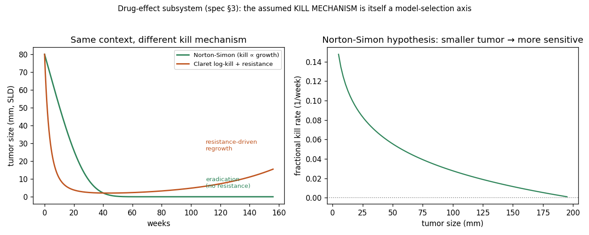

```python
ns = onkos.simulate(ds, "drug_effect.norton_simon.nsclc", context=ctx, drug_effect=1.0)
# fractional kill rate rises as the tumor shrinks — the Norton-Simon signature
```

### Mechanistic resistance: the resistant subclone as a model-selection axis

Resistance is the project's most load-bearing term (spec §1: the λ "Hydra"). Onkos
modeled it *phenomenologically* — the Claret model fades the drug effect as
`e^{−λt}`, a curve-fitting device whose λ has no cellular referent and is ~90%-CV
unidentifiable. v0.24 adds the *mechanistic* alternative: a tumor of a drug-**sensitive**
clone and a pre-existing drug-**resistant** clone (the Goldie-Coldman two-population
model), observed together as `V = S + R`:

```text
dS/dt = (kg − kd·E)·S      sensitive: net growth kg, killed at potency kd by effect E
dR/dt =  kgr·R             resistant: grows at kgr, NOT killed
S(0) = V0 ,  R(0) = R0     a small pre-existing resistant burden R0
```

The drug crushes the sensitive clone to a nadir; the untouched resistant clone then
outgrows — the *mechanistic* origin of the nadir-then-regrowth the phenomenological λ
approximates by hand. Crucially, the resistance is now a **biologically interpretable
parameter** (`R0`, the initial resistant burden) in place of an unidentifiable rate, and
the choice between the two resistance models becomes a model-selection axis (the
kill-mechanism move, applied to resistance itself).

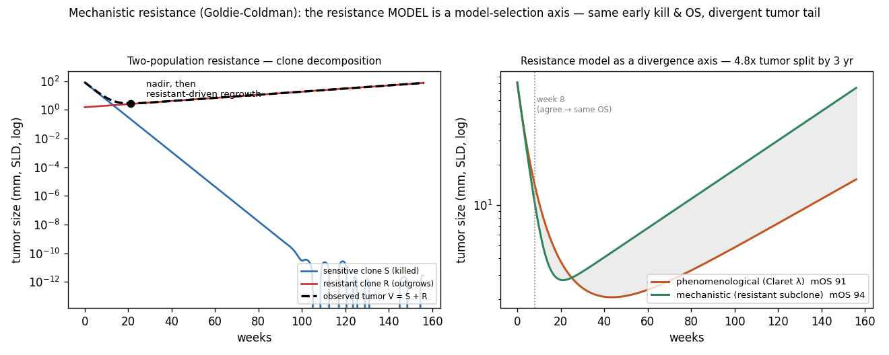

**The sharp, honest finding — and where it hides.** The two models are tuned to share the
early kill (matched `kd`), so they agree at **week 8** (≈−87% vs −82% change) and hence on
the **week-8-driven OS** (median ≈94 vs ≈91 wk) — yet they diverge **≈5× in the tumor tail**
(≈74 vs ≈15 mm at 3 years), because one regrowth is a fading effect and the other a
compounding clone. This is the short-trial-indistinguishable, long-horizon-divergent failure
mode exactly — and it carries a second lesson: a **week-8-based OS surrogate is nearly blind
to the resistance-model choice**, which is how a short-trial-fit resistance model transports
silently into a late-phase prediction it cannot support. Adding the mechanistic model to the
NSCLC divergence view raises the measured model-selection fraction from 0.39 to **0.47** —
the resistance-model axis is real between-model risk. The model is round-trip-validated
(both compartments export to SBML/NONMEM), landmark-tested (`tests/test_two_population.py`:
the closed form, eradication at `R0=0`, the late-time slope → `kgr`, the nadir, resistant-
fraction monotonicity), and *mechanistic does not mean measured* — `R0` is still tier C and
practically unidentifiable from a realistic trial (it composes with the v0.22 analyzer).

```python
mech = onkos.simulate(ds, "resistance.nsclc_first_line.two_population", context=ctx)
mech.tumor_size            # V = S + R: nadir, then resistant-clone regrowth
mech.tier                  # C; out-of-context transport still floors to D
# It joins the divergence view automatically — two resistance mechanisms, one context.
```

### Combination therapy: the interaction model is itself a model-selection axis

Oncology is overwhelmingly *combination* therapy, and a composed forecast for a
combination hides one unmeasured choice — **how do the two drugs' effects combine?**
`onkos.interaction` makes that choice a quantified model-selection axis, the same
"make the silent assumption visible" move as the kill mechanism above, one layer up.
Two single-agent effects `E_A, E_B` combine into one effective effect under each
declared interaction rule, which then drives the *existing* TGI → survival chain:

```text
hsa       E_AB = max(E_A, E_B)                 highest single agent (conservative null)
additive  E_AB = E_A + E_B                     Bliss-independence / effect-additive null
greco     E_AB = E_A + E_B + ψ·√(E_A·E_B)      interaction index (ψ>0 synergy, ψ<0 antagonism)
```

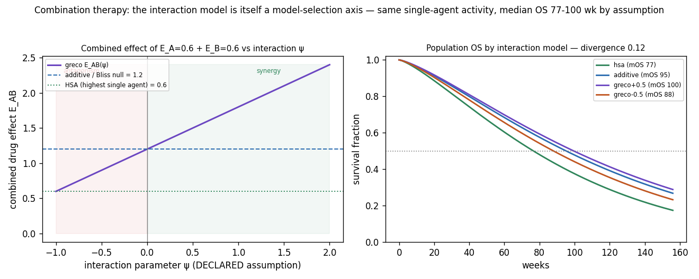

For the *same* single-agent activity, the interaction assumption alone moves predicted
median OS across a wide range (≈77–100 wk for `E_A=E_B=0.6` on the Claret NSCLC model)
— the over-optimism that sinks combination programs, now a measured divergence rather
than a buried assumption. **Synergy is treated as an assumption, never a finding:** `ψ`
is a declared input (default 0, the additive null), never fitted from the dataset, and a
non-zero value carries a warning — distinguishing synergy from additivity requires a
combination trial designed for it. A neat identity falls out and is landmark-tested:
for log-linear kill, **Bliss independence is exactly additive kill rates**
(`e^{−E_A·Δt}·e^{−E_B·Δt} = e^{−(E_A+E_B)·Δt}`), so Onkos states the equivalence rather
than hiding it. Population/regimen level only — it simulates one combination under
different interaction *assumptions*, never ranks regimens, and the underlying model's
tier governs and cannot be raised. An inactive partner reduces to monotherapy under
every model (no manufactured interaction). The combination math is proven against a
landmark suite (`tests/test_interaction.py`): the layer *is* the standard interaction
nulls (Bliss 1939, Loewe 1953, HSA/Berenbaum 1989, the Greco 1995 interaction index) and
a monotone interaction index, not an unconstrained synergy knob.

```python
from onkos.interaction import compare_interactions
cmp = onkos.compare_interactions(ds, "resistance.claret_2009.tgi", context=ctx,
                                 effect_a=0.6, effect_b=0.6, psi=0.5)
cmp.combined_effects        # {hsa, additive, greco±ψ} -> E_AB
cmp.median_os               # predicted median OS per interaction model
cmp.os_divergence           # how much OS depends on the interaction assumption alone
cmp.median_os_range, cmp.warnings   # incl. the synergy-is-an-assumption note
```

---

## Install & quick start

```bash
git clone https://github.com/clay-good/onkos
cd onkos
python -m venv .venv && source .venv/bin/activate
pip install -e ".[dev]"        # or: pip install -e .   (runtime only)

onkos validate                 # JSON-Schema-validate the dataset
onkos info                     # counts by subsystem / tier / review status
onkos simulate --compare       # the divergence view (NSCLC, 1L by default)
```

### Python API (cheat sheet)

```python
import numpy as np
import onkos

ds = onkos.load()
m = ds["resistance.claret_2009.tgi"]
m.tier                                     # "C"
m.derivation_context.tumor_type            # "NSCLC"
m.transportability.validated_tumor_types   # ("NSCLC",)
m["lambda"].iiv_cv_percent                 # 96   -> uncertainty is first-class
m.review_status                            # "unverified"
m.primary_citation.doi                     # "10.1200/JCO.2008.21.0807"

# Population-level forward simulation (NO individual prognosis, NO therapy ranking)
ctx = dict(tumor_type="NSCLC", line="first")
traj = onkos.simulate(ds, "resistance.claret_2009.tgi",
                      context=ctx, drug_effect=1.0, t=np.linspace(0, 104, 209))
traj.tumor_size, traj.os_curve             # tumor-size + population OS trajectory
traj.survival                              # {"OS": curve, "PFS": curve}
traj.median_os, traj.median_pfs            # PFS < OS by construction
traj.tier, traj.warnings                   # propagated tier + transport warnings
traj.metrics["week8_relative_change"]      # the TGI metric feeding the survival link

# Virtual-trial comparison — the headline feature
cmp = onkos.compare(ds, purpose="tgi", context=ctx, drug_effect=1.0)
cmp.os_divergence, cmp.pfs_divergence      # model-choice dependence of OS / PFS
cmp.median_os_range                        # (lo, hi) median OS across models
cmp.excluded                               # models greyed out for out-of-context transport
cmp.to_json(include_curves=True)           # serializable result for dashboards / external simulators

# Model averaging — split the forecast into parameter noise vs model-choice risk
ma = cmp.model_average(target="median_os_weeks", endpoint="OS", weights="equal")
ma.point, ma.tier                          # averaged median OS; worst included tier
ma.within_var, ma.between_var              # law-of-total-variance components
ma.model_selection_fraction                # BETWEEN / TOTAL — irreducible model-choice risk
ma.curve, ma.between_band                  # S̄(t) + pointwise between-model ±1σ
cmp.uncertainty_decomposition()            # per-scheme (equal/tier/evidence) table

# Parameter uncertainty — propagate the stored IIV CVs (Monte-Carlo bands)
ens = onkos.simulate_ensemble(ds, "resistance.claret_2009.tgi", context=ctx, n=400, seed=0)
ens.tumor_size.median, ens.tumor_size.lo, ens.tumor_size.hi   # 5–95% band arrays
ens.os_curve.lo, ens.os_curve.hi                               # population-OS band
ens.metrics["median_os_weeks"]             # {"median", "lo", "hi"}

# Sensitivity — attribute the OS-prediction variance to parameters (verify first)
res = onkos.sensitivity(ds, "resistance.claret_2009.tgi", context=ctx, target="median_os_weeks")
res.dominant.symbol                        # "kD"
res.indices                                # ranked [ParamSensitivity(symbol, src, contribution), …]

# Practical identifiability — can a realistic trial design even estimate the params?
idn = onkos.identifiability(ds, "resistance.claret_2009.tgi", context=ctx,
                            schedule=[0, 6, 12, 18, 24, 36, 48])   # weeks
idn.practically_identifiable               # False — under this design
idn.collinearity_index                     # γ_K ≈ 22 (confounded combination)
[(p.symbol, round(p.rse_percent), p.iiv_cv_percent) for p in idn.params]  # RSE vs stored CV
idn.worst.symbol                           # least-identifiable parameter (curation triage)

# Combination therapy — the interaction model as a model-selection axis
cmp = onkos.compare_interactions(ds, "resistance.claret_2009.tgi", context=ctx,
                                 effect_a=0.6, effect_b=0.6, psi=0.5)
cmp.combined_effects                       # {hsa, additive, greco±ψ} -> combined effect E_AB
cmp.median_os, cmp.os_divergence           # predicted OS per model; interaction-model divergence
onkos.combine_effects(0.6, 0.6, model="greco", psi=0.5)   # the pure interaction math
```

### CLI (cheat sheet)

| Command | Does |
| --- | --- |
| `onkos version` | print version |
| `onkos validate` | JSON-Schema + referential-integrity check of the dataset |
| `onkos info` | counts by subsystem / tier / review status |
| `onkos report [--output FILE]` | dataset health & external-validation report (Markdown) |
| `onkos audit` | evidence-based tier audit — flags tier inflation (also run inside `validate`) |
| `onkos simulate <id> [--tumor-type --line --drug-effect]` | one model's trajectory + metrics |
| `onkos simulate --compare [--json --include-curves]` | virtual-trial divergence across eligible models (text or JSON) |
| `onkos compare --average [--weights --decompose --json]` | model-averaged forecast + within/between variance decomposition |
| `onkos uncertainty <id> [--n --seed]` | Monte-Carlo parameter-uncertainty bands (propagates IIV CV) |
| `onkos sensitivity <id> [--target --n]` | rank parameters by how much their IIV drives a target metric |
| `onkos identify <id> [--schedule --sigma-prop]` | predicted RSE vs stored CV — can a realistic trial design estimate the parameters? |
| `onkos interactions <id> [--effect-a --effect-b --psi]` | drug-combination divergence — the interaction model as a model-selection axis |
| `onkos export --format <fmt> --output <dir>` | generate artifacts |

Export formats: `nonmem`, `sbml`, `pharmml`, `so` (PharmML Standard Output),
`rxode2`, `pumas`, `vt-json`, `jsonld` (linked data), `omex`, `csv`, `bibtex`. The
COMBINE `.omex` bundles SBML + PharmML + the SO + virtual-trial JSON + JSON-LD +
provenance into one citable archive.

### Dashboard

```bash
pip install -e ".[dashboard]"
streamlit run dashboard/app.py
```

The Streamlit dashboard is a thin presentation layer over the tested package API
(`compare`, `simulate_ensemble`, `sensitivity`) — three tabs: the **divergence
view** (tumor / OS / PFS curves + divergences + the greyed-out excluded models),
an **analyze-a-model** tab (uncertainty bands + the sensitivity tornado for any
included model), and a **dataset browser**. Because all logic lives in the
package, the dashboard's data is unit-tested and CI keeps `dashboard/app.py`
linted and compiling against the current API.

---

## The record — the unit of curation

A record is a structured object, not a scalar. Two kinds share one schema: a
**model** record (e.g. the Claret 2009 TGI model) and a **context-baseline**
record (e.g. NSCLC first-line baseline growth). The fields that carry the
project:

- **`derivation_context`** — the exact drug, tumor type, line, trial, and
  measurement basis a parameter came from. Machine-readable, mandatory.
- **`transportability`** — how far beyond that origin it has actually been
  validated. Crossing this boundary forces a tier penalty.
- **`iiv_cv_percent`** — inter-individual variability on the high-uncertainty
  kill/resistance terms, so a 90%-CV term cannot masquerade as a point estimate.

```jsonc
{
  "id": "resistance.claret_2009.tgi",
  "kind": "model", "purpose": "tgi", "subsystem": "resistance",
  "kernel": "claret_tgi",
  "structure": { "growth_law": "exponential",
                 "kill_model": "first_order_exposure_driven",
                 "resistance": "exponential_decay_of_kill" },
  "parameters": [
    { "symbol": "kL",     "tier": "B", "value": {"central": 0.021, "units": "1/week"} },
    { "symbol": "kD",     "tier": "C", "iiv_cv_percent": 89, "value": {"central": 0.30, "units": "1/week per effect-unit"} },
    { "symbol": "lambda", "tier": "C", "iiv_cv_percent": 96, "value": {"central": 0.061, "units": "1/week"} }
  ],
  "derivation_context": { "drug": "dacomitinib", "drug_class": "EGFR_TKI",
                          "tumor_type": "NSCLC", "line_of_therapy": "first" },
  "transportability": { "validated_tumor_types": ["NSCLC"],
                        "out_of_context_action": "tier_down_to_D and warn" },
  "tier": "C", "review_status": "unverified", "primary_citation": "claret-2009-tgi"
}
```

> **Honesty note.** v0.1 parameter values are *illustrative* and `unverified` by
> design — see the [verification checklist](CONTRIBUTING.md). The infrastructure
> (schema, kernels, tier propagation, round-trip-validated exports) is real and
> tested; promoting records to `verified` from source PDFs is the
> highest-leverage contribution.

---

## Confidence tiers and propagation

| Tier | Meaning |
| --- | --- |
| **A** | Model + parameters externally validated; TGI→survival link held in ≥1 *independent* trial; broad context. |
| **B** | One robust model from a well-powered trial with at least a partial external check. |
| **C** | Single trial, narrow tumor type/line; no external validation; high-CV kill/resistance terms. |
| **D** | Transported outside its validated context, **or** hypothesis-tier (e.g. immuno-oncology). **Not predictive.** |

Two rules are enforced in code (`onkos/tiers.py`, tested in `tests/`):

1. **Worst input wins.** A composed simulation (`growth + drug_effect +
   resistance + exposure_response + survival_link`) inherits the worst component
   tier.
2. **Out-of-context transport forces a tier floor of D + a warning.** You cannot
   get an A-looking forecast from a model validated only on a different tumor
   type. This is what greys models out in the divergence view.


### Tiers are partly numeric — and audited

The spec (§5, §9) says a clinical model's tier is partly a *numeric* judgment:
A/B require an external check (a recorded external C-index), and a poorly-identified
kill/resistance term (IIV CV ≥ 70%) is a tier-C characteristic. `onkos audit`
derives the **best tier the recorded evidence supports** ("ceiling") for each
clinical TGI / survival record and flags any whose assigned tier is *better* than
that — **tier inflation**, the dangerous direction. The check runs inside `onkos
validate`, so an over-claimed tier fails CI and cannot regress.

```text
$ onkos audit
  record                                tier  ceiling        status
  resistance.claret_2009.tgi               C        C           ok    # ~96% CV resistance term -> C
  survival_link.nsclc_os_week8             C        B  conservative    # external check, well-identified -> B available
  inflated (tier exceeds evidence): 0
```

The shipped dataset has **zero inflations** and is deliberately conservative
(records with an external metric but high-CV terms sit at C); the audit surfaces
the upgrade candidates without forcing them — the curator reconciles tier with
evidence, exactly as §5 intends.

---

## Models & kernels

Every model binds to a **pure-NumPy/SciPy reference kernel** in
`onkos/export/reference.py`, the single computational ground truth. `E` is the
drug-effect magnitude that scales the kill term — supplied directly or derived
from a PK exposure through an exposure-response kernel (below).

| Kernel | Kind | Dynamics | Records |
| --- | --- | --- | --- |
| `growth_exponential` | ODE | `dV/dt = kg·V` | `growth_laws.exponential` |
| `growth_logistic` | ODE | `dV/dt = kg·V·(1 − V/Vmax)` | `growth_laws.logistic` |
| `growth_gompertz` | ODE | `dV/dt = kg·V·ln(Vmax/V)` | `growth_laws.gompertz` |
| `claret_tgi` | ODE | `dy/dt = kL·y − kD·E·e^(−λt)·y` (log-kill + resistance) | `resistance.claret_2009.tgi` |
| `norton_simon` | ODE | `dV/dt = (g − k·E)·V·ln(Vmax/V)` (kill ∝ growth) | `drug_effect.norton_simon.nsclc` |
| `biexp_tgi` | ODE | `y = y0·(e^(−ks·E·t) + e^(kg·t) − 1)` (shrink + regrowth) | `tgi_metrics.wang_2009.*`, `tgi_metrics.bruno_2020.*` |
| `survival_weibull_ph` | survival | `S(t) = exp(−(t/scale)^shape · e^(β·x))`, `x` = week-8 change | `survival_link.*_os_week8`, `…_pfs_week8` |
| `survival_cox_ph` | survival | `S(t) = S0(t)^e^(β·x)`, `S0` = tabulated baseline | `survival_link.nsclc_os_cox` |
| `er_emax` | exposure-response | `E = Emax·C/(EC50+C)` | `exposure_response.emax_generic`, `…dacomitinib_egfr.emax` |
| `er_sigmoid_emax` | exposure-response | `E = Emax·C^γ/(EC50^γ+C^γ)` | `exposure_response.sigmoid_emax_generic` |
| `er_power` | exposure-response | `E = slope·C^θ` | `exposure_response.power_generic` |
| `simeoni_exp_linear` | ODE | `dw/dt = λ0·w / (1+(λ0·w/λ1)^ψ)^(1/ψ)` (exp→linear) | `growth_laws.simeoni_exp_linear` |
| `simeoni_tgi` | ODE (4-state) | transit-chain TGI; observe `w = x1+x2+x3+x4` | `preclinical_translation.simeoni_2004.xenograft` |
| `ivive_power` | exposure-response | `potency = scale·IC50^power` | `preclinical_translation.ivive_potency` |
| `io_tumor_immune` | ODE (2-state) | Kuznetsov tumor–immune predator-prey (**hypothesis-tier**) | `immuno_oncology.kuznetsov_1994.tumor_immune`, `…poorly_immunogenic.hypothesis` |

---

## Exposure-response & PK composability (Phase B)

The exposure-response (ER) layer maps a PK exposure metric `C` (C_avg, AUC,
C_max) to the drug-effect magnitude `E` that drives a TGI model's kill term. This
makes the **potency** of a regimen first-class (with its own tier and IIV) and
completes the chain **PK → exposure → tumor dynamics → survival** — the seam
where a [Hypnos](#licensing--citation) PK record composes with an Onkos TGI
model. A *time-varying* exposure (a full PK profile aligned to `t`) yields a
time-varying `E(t)`, and the tumor ODE is integrated numerically; a scalar
exposure uses the fast closed form.


```python
import numpy as np, onkos
ds = onkos.load()
ctx = dict(tumor_type="NSCLC", line="first")

# Scalar exposure -> Emax transform -> drug effect -> Claret TGI -> OS
traj = onkos.simulate(ds, "resistance.claret_2009.tgi", context=ctx,
                      exposure=200.0,                                   # C_avg in µg/L
                      exposure_response="exposure_response.dacomitinib_egfr.emax")

# Time-varying PK profile (e.g. piped from Hypnos) -> E(t) -> ODE integration
t = np.linspace(0, 104, 209)
C = 300.0 * np.exp(-0.02 * t)                                          # declining exposure
traj = onkos.simulate(ds, "resistance.claret_2009.tgi", context=ctx,
                      exposure=C, exposure_response="exposure_response.emax_generic", t=t)
```

```text
$ onkos simulate resistance.claret_2009.tgi \
    --exposure 200 --exposure-response exposure_response.dacomitinib_egfr.emax
resistance.claret_2009.tgi  tier=C  (exposure=200.0 via exposure_response.dacomitinib_egfr.emax)
```

The ER record's tier and `transportability` propagate like any other component:
an ER model validated only on NSCLC/EGFR-TKI floors an out-of-context simulation
to **D** with a warning, exactly as the TGI and survival components do.

---

## Tumor-context library (Phase C)

The divergence view is only broadly useful if it has a context to run in. Phase C
builds the `tumor_type_baselines` library and the matching per-context survival
links, so every supported tumor type carries:

- a **baseline** (`tumor_type_baselines.*`) — baseline SLD `y0` and unperturbed
  growth, supplying the simulation's initial conditions;
- a **survival link** (`survival_link.*_os_week8`) — a tumor-specific Weibull-PH
  OS model whose scale reflects that indication's baseline prognosis;
- **≥2 eligible TGI models** (a Claret resistance form + a biexponential form),
  so model-selection risk is measurable rather than hypothetical.

| Context (1L) | baseline SLD | OS scale (wk) | eligible TGI models | OS divergence |
| --- | --- | --- | --- | --- |
| NSCLC | 80 mm | 60 | Claret 2009 · Wang 2009 biexp | 0.25 |
| breast | 55 mm | 130 | breast Claret · Bruno 2020 biexp | 0.16 |
| CRC | 90 mm | 95 | CRC Claret (capecitabine) · CRC biexp | 0.26 |
| HCC | 110 mm | 48 | HCC Claret · HCC biexp | 0.33 |
| melanoma | 60 mm | 85 | melanoma Claret · melanoma biexp | 0.25 |

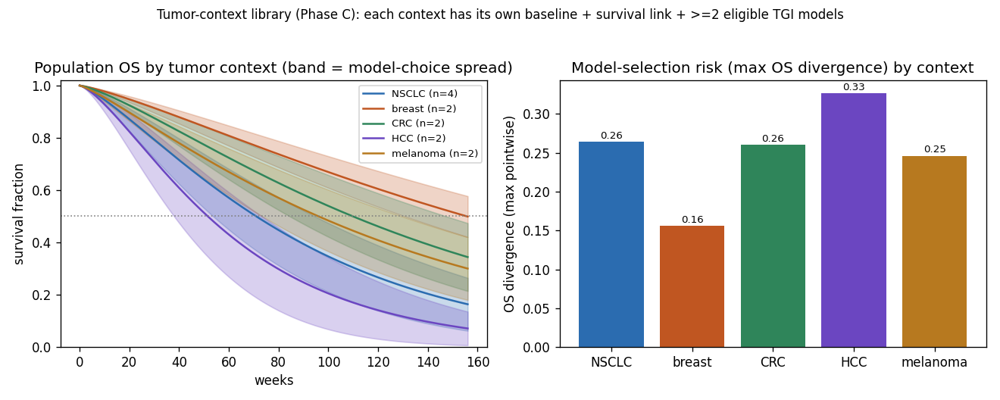

Each context resolves its own baseline and survival link automatically; a model
from one tumor type applied to another is greyed out (floored to **D**) by the
same transportability rule. Values are illustrative and `unverified` by design.

```python
import onkos
ds = onkos.load()
for tt in ["NSCLC", "breast", "CRC", "HCC", "melanoma"]:
    cmp = onkos.compare(ds, purpose="tgi", context=dict(tumor_type=tt, line="first"))
    print(tt, len(cmp.included), round(cmp.os_divergence, 2))
```

---

## Preclinical translation (Phase D)

The discovery-to-clinic bridge. Onkos implements the canonical **Simeoni 2004**
xenograft PK/PD model — the project's first *multi-state* ODE system. Unperturbed
growth is exponential then linear; drug at concentration `E` damages
proliferating cells (`x1`) at rate `k2·E`, and damaged cells traverse a
**signal-distribution transit chain** `x2→x3→x4` (rate `k1`) before dying, which
produces the characteristic *delayed* cell death. The observed tumor weight is
`w = x1+x2+x3+x4`.

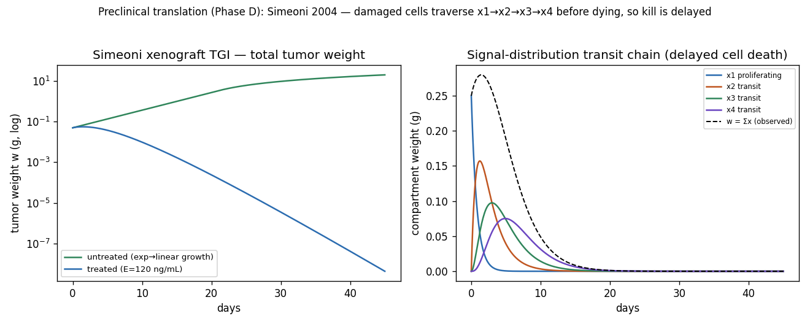

```
dx1/dt = λ0·x1 / (1+(λ0·w/λ1)^ψ)^(1/ψ) − k2·E·x1      (proliferating)
dx2/dt = k2·E·x1 − k1·x2                               (damaged, transit)
dx3/dt = k1·x2  − k1·x3
dx4/dt = k1·x3  − k1·x4                  w = x1+x2+x3+x4 (observed weight)
```

Multi-state systems have no closed form, so the kernel framework integrates them
numerically and validates exports state-by-state: the SBML round-trip re-parses
**each** rate rule's MathML and checks it against the reference `rhs`, and the
NONMEM stream emits one `$DES` compartment per state. A concentration profile can
drive the kill term directly (`exposure=...`), so a Hypnos PK curve composes here
too.

```python
# Dose-dependent xenograft TGI (concentration drives the kill term directly)
tr = onkos.simulate(ds, "preclinical_translation.simeoni_2004.xenograft",
                    context=dict(tumor_type="ovarian_xenograft"), drug_effect=120.0)
tr.tumor_size                      # total tumor weight w(t)
tr.os_curve                        # None — preclinical models carry no survival link
```

**In-vitro → in-vivo translation.** `preclinical_translation.ivive_potency` maps
an in-vitro potency (e.g. IC50) to an in-vivo potency parameter
(`potency = scale·IC50^power`). The assumption that in-vitro potency predicts
in-vivo activity is itself what must be validated (Rocchetti 2007), so the record
is tiered and annotated accordingly. Preclinical records are **excluded from the
clinical divergence view** and applying xenograft parameters to a human tumor
floors the result to **D** — the translation gap, made explicit.

---

## Immuno-oncology (Phase E) — represented honestly, not predictively

> 🛑 **HYPOTHESIS-TIER. NOT FOR PREDICTION.** The immuno-oncology subsystem ships
> **tier D by construction** because the quantitative validation to do otherwise
> honestly does not yet exist (spec §2, §3, §5, §10).

Onkos includes the **Kuznetsov 1994** tumor–immune QSP model — a 2-state
predator-prey system (tumor + effector cells) that reproduces the field's
qualitative regimes: immune **control / dormancy**, immune **escape**, and the
bistable **rescue** when an immunotherapy effect (e.g. checkpoint blockade)
pushes the system across its threshold.

```
d tumor/dt    = α·tumor·(1 − β·tumor) − (1+E)·effector·tumor
d effector/dt = s + ρ·effector·tumor/(η+tumor) − μ·effector·tumor − δ·effector
```

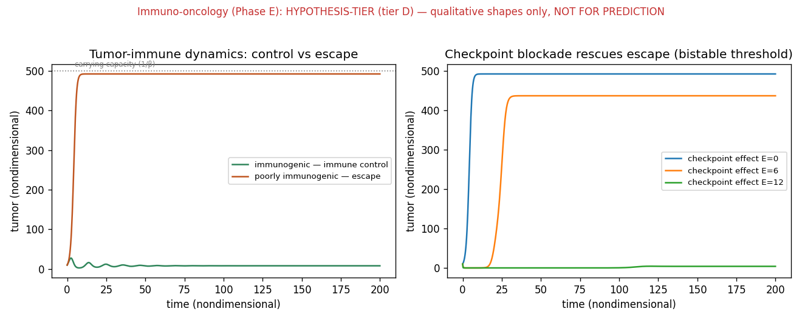

The non-predictive stance is enforced in code, not just documented:

- the **validator rejects** any immuno-oncology record (or parameter) that is not
  tier D — `onkos validate` fails otherwise;
- every export carries `onkos:predictionStatus = "DO NOT USE FOR PREDICTION
  (hypothesis-tier)"` and the virtual-trial JSON sets `DO_NOT_USE_FOR_PREDICTION: true`;
- IO models are **excluded from the clinical divergence view** and never receive
  a survival link (no OS curve).

This is the Nidus "Phase-C" convention: the frontier is represented so it can be
explored and exported, but it can never masquerade as validated.

---

## Dataset health & releasing (Phase F)

`onkos report` turns the dataset's own honesty fields into a machine-generated
health report ([`docs/dataset-health.md`](docs/dataset-health.md)), kept in sync
with the data by a CI gate. It surfaces tier and review-status coverage, the
external-validation backlog, and the hypothesis-tier records.

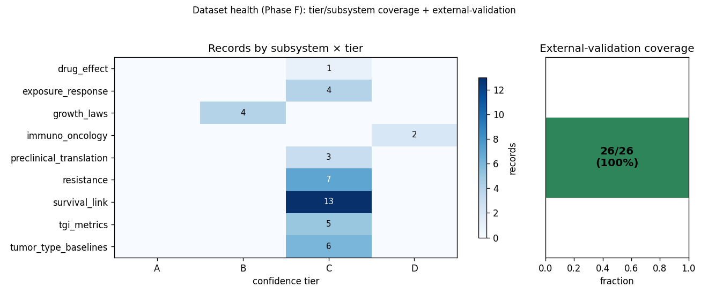

```text
$ onkos report | head
# Onkos dataset health report
- Records: 33  ·  Citations: 8
- Verified (PDF-checked): 0 / 33
- External-validation coverage (clinical TGI + survival models): 15 / 15  100%
```

**Releasable, proven in CI.** The dataset is the source of truth at the repo
root; `scripts/sync_dataset_into_package.py` copies it into the package as
`_dataset/` for packaging. The CI `release` job builds the wheel, installs it
into a clean environment, and runs `onkos validate / info / report` and a
simulation **from outside the repository** — proving the bundled dataset ships
and resolves without a source checkout. Resolution order puts the source
`dataset/` first so a stale synced copy can never shadow live edits during
development; the bundled `_dataset/` is the wheel-only fallback.

Release metadata: [`CHANGELOG.md`](CHANGELOG.md), [`.zenodo.json`](.zenodo.json)
(Zenodo concept DOI on first deposit), [`CITATION.cff`](CITATION.cff), and a
`py.typed` marker so downstream type-checkers see Onkos's annotations.

---

## Architecture

The **dataset is the single source of truth**; everything else is a deterministic
projection. The system is layered — data → core → kernels → analyses → exports →
presentation — and the layering is pinned by `tests/test_architecture.py` (every
declared subsystem has records, every kernel is bound, the CLI export formats
match the builders *and* the CI sweep, the public API surface is stable).

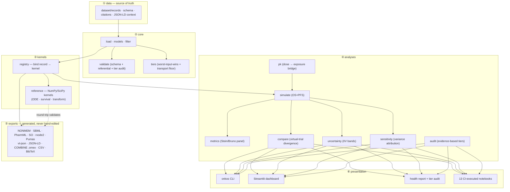

### Kernel taxonomy

Every model binds to one **pure-NumPy/SciPy reference kernel** (the single
computational ground truth). Kernels come in three kinds:

| Kind | What it computes | Kernels |
| --- | --- | --- |
| **ODE** | tumor-size dynamics `dV/dt` (closed form where one exists, else integrated) | `growth_exponential/logistic/gompertz`, `claret_tgi`, `norton_simon`, `biexp_tgi`, `two_population_resistance` (2-clone), `simeoni_exp_linear`, `simeoni_tgi` (4-state), `io_tumor_immune` (2-state) |
| **survival** | population survival `S(t \| x)` from a TGI metric | `survival_weibull_ph` (parametric), `survival_cox_ph` (nonparametric baseline) |
| **transform** | algebraic map (exposure → effect, or in-vitro → in-vivo) | `er_emax`, `er_sigmoid_emax`, `er_power`, `ivive_power` |

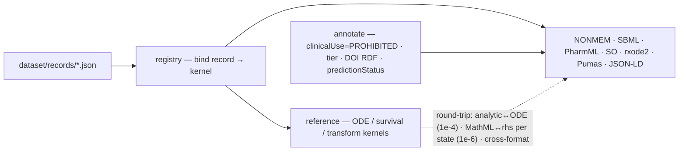

### Round-trip validation — why exports cannot lie

Each ODE kernel declares three *independent* expressions of the same dynamics: a
closed-form `analytic` solution, a hand-written `rhs`, and an `rhs_infix` string.
CI checks ([`tests/test_roundtrip.py`](tests/test_roundtrip.py)):

- **analytic vs. SciPy ODE integration** → agreement to ~1e-4 (single-state
  closed forms; validates the rhs);
- **SBML re-parsed**: the generated MathML rate law is converted back to an
  expression and evaluated against `rhs` → ~1e-6, **per state** (so the
  multi-state Simeoni system is checked compartment-by-compartment);
- **NONMEM re-parsed**: `$THETA` initial estimates must equal the dataset values,
  and one `$DES` compartment is emitted per state;
- **rxode2 / Pumas / SO re-parsed**: the parameter vector is read back from each
  and must equal the dataset values;
- **cross-format consistency**: NONMEM, SBML, PharmML-SO, rxode2, and Pumas must
  all agree on the parameter values — one source of truth, five renderings.

Multi-state kernels (Simeoni) have no closed form, so the analytic check is
skipped for them and the rhs is instead pinned by the per-state SBML round-trip
plus behavioral tests (exp→linear growth, dose-dependent shrinkage, transit
delay). An export bug therefore cannot ship silently.

### Scientific landmark validation — why a kernel *is* the model it names

Round-trip validation proves the *exports* agree with the kernel. It does **not**
prove the kernel reproduces the published model it claims to implement — a kernel
can be internally self-consistent yet be the wrong dynamics. A **second,
independent validation axis** ([`tests/test_landmarks.py`](tests/test_landmarks.py),
catalogued in [`docs/validation-landmarks.md`](docs/validation-landmarks.md))
closes that gap: every kernel is checked against the characteristic,
analytically-derivable **landmark** of its model.

| Model | Landmark the kernel must reproduce |
|---|---|
| Gompertz | growth rate peaks at `V = Vmax/e` (the published inflection) |
| Logistic | growth rate peaks at `V = Vmax/2` |
| Norton-Simon | tumor is stationary at *every* size when `E = g/k` |
| Simeoni TGI | proliferating compartment is static at `c* = λ0/k2` (tumor-static concentration) |
| Bi-exponential | nadir at `t* = ln(ks·E/kg)/(kg+ks·E)` |
| Weibull-PH | median at `scale·(ln2)^(1/shape)`; `S_x = S₀^exp(β·x)` |
| Emax / sigmoid | half-maximal effect exactly at `C = EC50` (any Hill γ) |
| IO tumor-immune | effectors relax to homeostasis `s/δ` with no tumor |

This is the honest reading of spec §9's "compare against published example
simulations": the landmark *is* the published property, derived from the model's
own equations, so **no digitized data is fabricated**. The two axes are
complementary — round-trip catches a mis-encoded export; landmarks catch a
mis-implemented model.

### Linked data (JSON-LD / RDF)

The curation fields are exported as **JSON-LD** so they become real RDF triples,
not JSON that merely uses `onkos:` keys. The single `@context`
(`dataset/schema/context.jsonld`) maps the friendly terms to the `onkos:`,
`bqbiol:`, and `dcterms:` vocabularies; `bqbiol:isDescribedBy` is typed as `@id`
so each record's DOI/PMID become resolvable `identifiers.org` resources. `onkos
export --format jsonld` writes per-record documents, and `dataset_jsonld(ds)`
emits the whole dataset as one `@graph`. CI validates this by **expanding the
output with rdflib** and asserting the expected triples (clinical-use prohibition,
confidence tier, DOI links) actually appear — the linked-data claim is tested, not
asserted.

```python
from rdflib import Graph
g = Graph().parse(data=onkos.export.to_jsonld(ds["resistance.claret_2009.tgi"]), format="json-ld")
# -> (record, bqbiol:isDescribedBy, <https://identifiers.org/doi/10.1200/JCO.2008.21.0807>)
```

### Design decisions

| Decision | Rationale |
| --- | --- |
| Pure Python (NumPy/SciPy); R/Julia only as export targets | Nothing is compute-bound; R/Julia models are generated artifacts, not runtime deps. |
| Dataset is the centerpiece; everything else is presentation | The durable contribution is the curated, tiered, context-annotated parameters. |
| `derivation_context` + `transportability` are first-class | Out-of-context transport is the dominant silent error; machine-enforcing it is the load-bearing idea. |
| IIV CV surfaced on kill/resistance terms | A ~90%-CV term must not present as a point estimate. |
| Tiers + transport warnings propagate; worst input wins | A forecast is only as trustworthy as its least-validated component. |
| Population-level forward simulation only | The line between research tool and clinical tool is exactly individual prediction. Onkos stays on the safe side by construction. |
| Exposure-response is a separate, tiered kernel (not baked into the TGI model) | Potency/uncertainty are drug-specific and reusable; decoupling them lets one ER record drive many TGI models and keeps the PK→effect seam explicit and tier-propagating. |
| Scalar exposure uses the closed form; time-varying PK integrates the ODE | Exactness and speed for the common case; correctness for a full PK profile, where the constant-E closed form would be wrong. |
| Multi-state kernels keep `analytic` optional; an `observable` maps states → the measured quantity | The Simeoni transit model has no closed form. Numerical integration + a per-state SBML round-trip preserve export-correctness guarantees without forcing a closed form; the observable (total weight = Σ compartments) decouples the measured signal from the latent states. |
| Hypothesis-tier (immuno-oncology) is enforced in code, not just documented | A "do not predict" note in prose is easy to ignore. The validator fails the build if an IO record is not tier D, exports carry a machine-readable `predictionStatus`, and IO is excluded from the clinical view — so the frontier can be explored but never masquerade as validated. |
| Parameter uncertainty is propagated, not just stored | Storing `iiv_cv_percent` but simulating on central values would let a ~90%-CV term pose as a point estimate. `simulate_ensemble` samples IIV lognormally (median-preserving) so the reported variability flows into tumor/OS bands — the second uncertainty axis alongside model-selection divergence. |
| TGI metrics are extracted model-agnostically (Stein method), not read from params | Reading k_g/k_s off a record only works for the biexponential; the Claret/Simeoni structures have no such params. Extracting them from the trajectory the way Stein extracts them from RECIST data makes the metric panel uniform across kernels — and recovers the generating rates as a built-in correctness check. |
| Sensitivity uses independent sampling so first-order indices are correlations | Sampling each IIV parameter independently makes the standardized regression coefficient equal the input-target correlation and the squared SRCs partition the variance — a first-order Sobol decomposition with no extra design. It also exposes that CV alone ≠ influence (influence is CV × effect-strength), pointing verification at the parameter that actually moves the prediction. |
| PharmML SO carries IIV as random-effect variance, never as estimate precision (RSE) | The SO's job is to report results, but the dataset curates inter-individual variability, not the precision of the population estimate. Encoding IIV as `omega = ln(1+CV²)` is faithful; fabricating an RSE we don't have would not be — so the precision block is deliberately omitted. |
| Linked data is validated by RDF expansion, not just emitted | A JSON file with `onkos:` keys is not automatically valid JSON-LD. Shipping a single `@context`, typing `isDescribedBy` as `@id`, and having CI expand the output with rdflib to check the triples means the machine-readability claim is enforced rather than assumed. |
| OS and PFS share one mechanism (a tagged survival link), not two code paths | Both endpoints are Weibull-PH links on the same week-8 TGI metric, distinguished only by a `structure.endpoint` tag and their scale. `simulate` returns a curve per endpoint found for the context, so adding PFS needed data, not new kernels — and every analysis (divergence, uncertainty, sensitivity) works on either endpoint for free. |
| The Cox link is non-default and opt-in, not an auto-selected competitor | Auto-discovery assumes one link per (context, endpoint). The Cox alternative carries `structure.default: false`, so it's reachable only via explicit `survival_link=` — turning "Weibull vs Cox" into a deliberate survival-model-choice comparison instead of a silent collision. Its tabulated baseline rides along in the vt-json / JSON-LD exports. |
| The dashboard owns no logic — it renders a tested, serializable result | The virtual-trial result is a `Comparison.to_dict()/to_json()` the package builds and tests; the Streamlit file only draws it. That keeps the headline view honest (the same numbers everywhere), lets external simulators ingest the JSON, and means CI catches UI/API drift by lint + compile, not by screenshots. |
| Confidence tiers are audited against evidence, not just hand-set | Spec §5 says tiers are "partly numeric." `onkos audit` derives the tier each clinical record's recorded external validation + IIV supports and fails `validate` on any inflation. A hand-set tier can't quietly over-claim — the honesty thesis applied to the honesty field itself. |
| Survival matching is line-aware; an unsupported line yields no curve, not a borrowed one | The line of therapy is part of the context, so a second-line simulation must use second-line survival — matching only on tumor type would silently transport a 1L model. When no curated link exists for a line, the honest result is no survival curve, mirroring the no-fallback rule for tumor type. |
| The PK bridge is a thin illustrative adapter, not a PK toolkit (that's Hypnos) | Onkos's scope is exposure → tumor → survival. `onkos.pk` exposes only the standard dose↔exposure relations and a profile-ingestion adapter so the composability chain is runnable self-contained; modelling the PK itself stays in Hypnos, and the generators are clearly labelled illustrative. |
| Kill mechanism is a separate subsystem, so it can be a divergence axis | Bundling the kill model into each TGI record would hide that two trials might shrink tumors identically yet predict different outcomes because one assumed log-kill and the other Norton-Simon. The `drug_effect` subsystem makes the mechanism an explicit, comparable choice — the same "make the silent assumption visible" move as `transportability`. |
| Resistance ships in two forms — phenomenological and mechanistic — so the resistance *model* is a divergence axis | The Claret model fits resistance as a fading drug effect (an unidentifiable λ); the two-population model derives it from a sensitive/resistant clone split (an interpretable `R0`). Shipping both, tuned to the same early kill, makes the resistance-*mechanism* choice an explicit, comparable model-selection axis — and surfaces that a week-8 OS surrogate barely sees the resulting tumor-tail divergence (the silent-transport risk), the honest counterpoint to "we modeled resistance." |
| The drug-interaction model is a model-selection axis, and synergy is an assumption not a finding | A combination's predicted benefit depends on how the two effects are assumed to combine (HSA / additive-Bliss / synergy), so `onkos.interaction` combines at the effect level and reports the OS divergence across those assumptions rather than picking one. The interaction parameter ψ is a *declared* input (never fitted from the dataset, flagged when non-zero): distinguishing synergy from additivity needs a combination trial designed for it, and asserting it without one is the over-optimism the divergence exposes. Combination at the effect level (not dose-level Loewe over the ER curves) is the v0.x scope, named not hidden. |
| The architecture is a *tested* contract, not just a diagram | `tests/test_architecture.py` asserts every declared subsystem has records, every kernel is bound (no orphans/dead kernels), the CLI export formats match both the builders and the CI sweep, and the public API surface is stable. These checks have already caught real drift (an empty `drug_effect` subsystem; a CI export loop missing `so`/`jsonld`), so the diagrams above stay honest. |
| Model-averaging weights are *combination* weights, never model posteriors | Posterior model probabilities `P(model\|data)` require the candidates to share one dataset; Onkos models are fit to different trials, so a posterior is not identifiable and would be invented. Framing the weights as Bates–Granger forecast-combination weights (and printing that everywhere) keeps the no-false-precision discipline; the headline output is a *fraction of uncertainty no better estimation can remove*, not a manufactured central probability. |
| The model average is structurally inseparable from its disagreement | A single combined curve *looks* like an answer, so `ModelAverage` cannot be serialized or drawn without its `model_selection_fraction` and worst tier; averaging cannot raise a tier, never rehabilitates an excluded model, and `M=1` returns fraction 0 *with* a warning. The combiner is post-processing over `compare`, validated by a landmark suite proving it *is* the law of total variance and a convex combination. |
| Composable with Hypnos | A shared export/annotation convention lets a Hypnos PK record drive an Onkos TGI model end to end via an exposure-response record. |

---

## Repository layout

```
onkos/
├── dataset/                     # SOURCE OF TRUTH
│   ├── schema/                  # JSON Schema + JSON-LD context
│   ├── records/                 # one JSON per model / context-baseline
│   └── citations/               # Crossref/PubMed citation records
├── python/onkos/
│   ├── load · filter · validate · tiers · simulate · metrics · pk · compare · uncertainty · sensitivity · combine · identify · interaction · audit · report · cli
│   ├── py.typed                 # PEP 561 typing marker
│   └── export/                  # registry · reference · nonmem · sbml · pharmml · pharmml_so
│       · rxode2 · pumas · virtual_trial_json · jsonld · combine · annotate
├── dashboard/app.py             # Streamlit: browse + divergence view
├── notebooks/                   # executed in CI (nbmake)
├── scripts/                     # sync_dataset_into_package · make_figures
├── tests/                       # schema · simulate · round-trip · CLI · report · …
├── docs/                        # essay · specs/v0.1/spec.md · dataset-health.md · images/
├── CHANGELOG.md · CITATION.cff · .zenodo.json   # release metadata
└── .github/workflows/ci.yml     # lint · test (3.9–3.12) · exports · releasable wheel
```

---

## Scope & safety

**In scope:** unperturbed growth laws; drug-effect/kill models; resistance/
regrowth (the λ term); exposure-response links; TGI-derived metrics; TGI-metric →
survival models; tumor-type/line baselines; a separated preclinical-translation
subsystem; immuno-oncology *only* as a hypothesis-tier, non-predictive subsystem.

**Out of scope (hard line, not a roadmap item):** any per-patient prognosis,
survival estimate for a real person, treatment recommendation, or therapy
ranking. The tell that the project has crossed its line is any feature that takes
a real patient's tumor measurement and returns a prognosis or a therapy choice.
**That feature does not get built.** See [spec §10](docs/specs/v0.1/spec.md).

---

## Roadmap

| Phase | Content | Status |
| --- | --- | --- |
| **A — TGI spine** | Growth laws + Claret TGI + NSCLC context + TGI→OS link + divergence view; NONMEM + SBML; round-trip validation. | ✅ v0.1 |
| **B — Resistance + exposure-response** | Emax / sigmoid-Emax / power ER kernels driving the kill term; scalar **and** time-varying PK-driven simulation (Hypnos composability); ER tier + transportability propagation; PharmML + rxode2/Pumas; IIV-CV surfaced. | ✅ v0.2 |
| **C — Survival + baselines** | `tumor_type_baselines` library + per-context Weibull-PH survival links across NSCLC, breast, CRC, HCC, melanoma; ≥2 eligible TGI models per context; cross-context divergence; orphan-record invariant enforced in CI. | ✅ v0.3 |
| **D — Preclinical translation** | Multi-state ODE framework; Simeoni 2004 xenograft model (exp→linear growth + signal-distribution transit chain); in-vitro→in-vivo potency translation; per-state SBML/NONMEM export + round-trip. | ✅ v0.4 |
| **E — Immuno-oncology** | Kuznetsov tumor–immune QSP, hypothesis-tier (tier D), non-predictive; tier-D enforced by the validator; DO-NOT-PREDICT annotation on every export; excluded from the clinical view. | ✅ v0.5 |
| **F — Hardening** | External-validation backfill (coverage 25/25); `onkos report` health report with CI sync gate; wheel-build releasability proven in CI; `.omex`, `.zenodo.json`, `CHANGELOG.md`, `py.typed`, `CITATION.cff`. | ✅ v0.6 |

The phased roadmap (spec §11, Phases A–F) is fully implemented. Work since then
follows a **research track** (`docs/specs/research/`) that deepens the project's
own thesis rather than adding breadth:

| Research track | Content | Status |
| --- | --- | --- |
| **Model-selection uncertainty** | `onkos.combine`: law-of-total-variance split of a composed forecast into parameter (within) vs model-selection (between) variance; the `model_selection_fraction`; declared `equal`/`tier`/`evidence` combination weights with cross-scheme fragility; the model-averaged `S̄(t)` curve + between-model band; report ranks contexts by irreducible model-choice risk. | ✅ v0.21 |
| **Practical identifiability** | `onkos.identify`: the design Fisher information + Cramér–Rao RSE + Brun collinearity index over the existing kernels; measures whether a realistic trial could estimate each parameter, pairs predicted RSE with stored IIV CV (flagging flat-likelihood-artifact CVs), and ranks models a realistic design cannot support; landmark-proven; cannot move a tier. | ✅ v0.22 |
| **Combination interaction** | `onkos.interaction`: combines two single-agent effects under declared interaction nulls (HSA / additive-Bliss / Greco interaction index ψ) and propagates through the existing TGI → survival chain; the interaction model becomes a quantified model-selection axis with its own OS divergence; synergy is a *declared assumption*, never fitted; the Bliss≡additive identity is landmark-tested; cannot rank regimens or raise a tier. | ✅ v0.23 |
| **Mechanistic resistance** | `two_population_resistance` kernel + record: the Goldie-Coldman sensitive/resistant two-clone model replaces the phenomenological decay-of-effect λ with an interpretable resistant burden `R0`; the resistance *mechanism* becomes a model-selection axis (phenomenological vs mechanistic), raising the NSCLC model-selection fraction 0.39 → 0.47; both compartments round-trip to SBML/NONMEM; landmark-tested; reveals that a week-8 OS surrogate is nearly blind to the resistance-model choice. | ✅ v0.24 |

Remaining work is **breadth and verification**: promoting `unverified` records to
`verified` from source PDFs, adding more drugs / tumor types / lines, and the
further steps in the research specs (see CONTRIBUTING.md and `docs/specs/`).

---

## Licensing & citation

- **Code:** MIT ([LICENSE](LICENSE)).
- **Dataset:** CC-BY-4.0 ([LICENSE-DATASET](LICENSE-DATASET)).
- **Citation:** [`CITATION.cff`](CITATION.cff). When you use a record, cite Onkos
  **and** the original source via `record.primary_citation.doi`.

Sibling projects: **Nidus** (gestational physiology, per-parameter tier) and
**Hypnos** (anesthetic PK/PD, applicability envelope). Hypnos and Onkos compose:
a Hypnos PK record can drive the exposure-response of an Onkos TGI model, giving
an open, tier-annotated PK → exposure → tumor-dynamics → survival chain.
