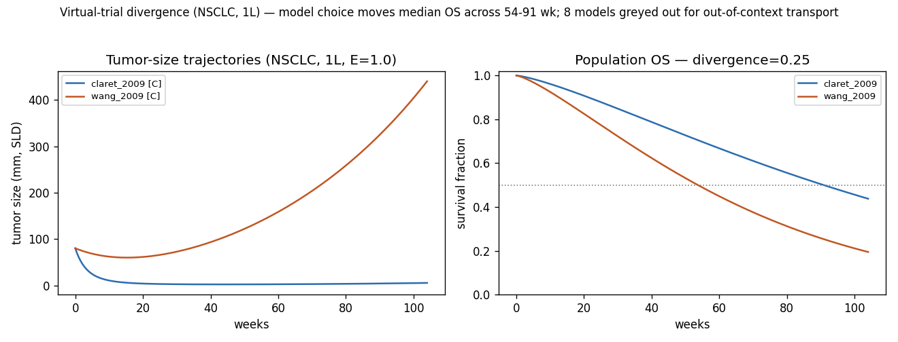
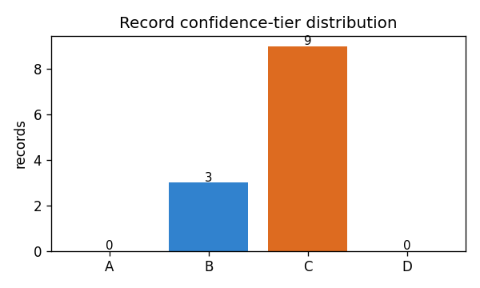
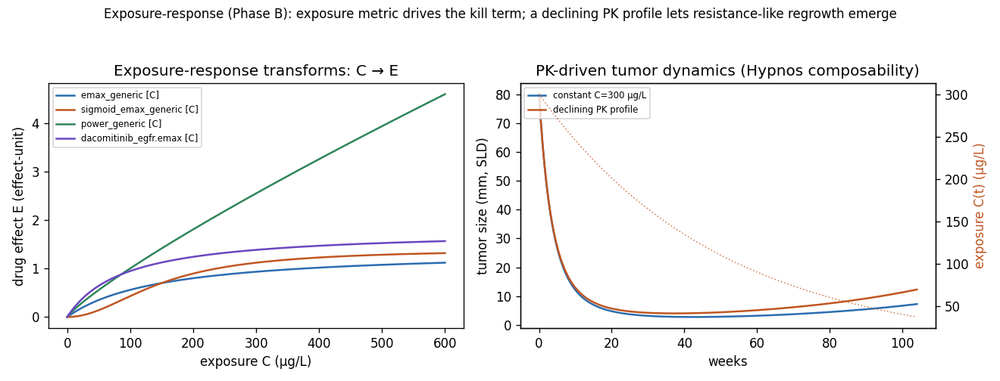
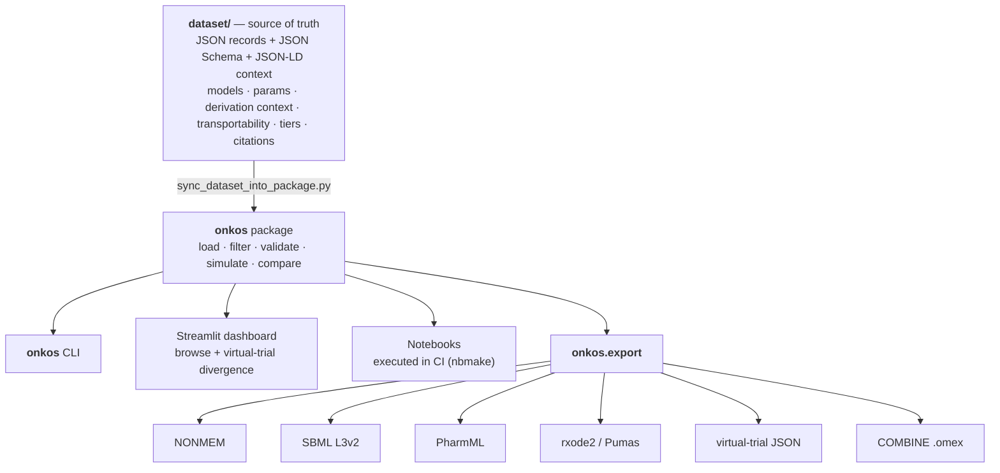
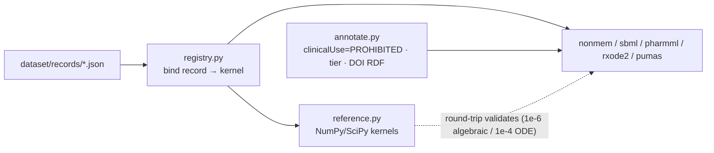

# Onkos

**A curated, citation-backed, tier-annotated dataset of tumor-growth-inhibition
(TGI) models, exposure-response links, and TGI-metric → survival models — the
machinery oncology drug development runs on — exported into the standard
pharmacometric and systems-biology formats (NONMEM, SBML, PharmML,
nlmixr2/rxode2, Pumas).**

> ⚠️ **NOT a clinical decision tool. NOT a prognostic calculator. NOT a
> treatment recommender.** Population/trial-level forward simulation only, for
> drug-development methodology, simulation, and education. Every export carries
> `onkos:clinicalUse = "PROHIBITED — research / drug-development / education only"`.

*Onkos* (Greek *ὄγκος*, "mass, swelling") is the literal root of *onco-*. It is
the third in a family with **Nidus** (gestational physiology) and **Hypnos**
(anesthetic PK/PD), sharing one thesis: **a model is only as trustworthy as its
weakest, least-validated input — so make that a first-class, machine-readable
field.**

[](https://github.com/clay-good/onkos/actions/workflows/ci.yml)
&nbsp;v0.2 · Code: MIT · Data: CC-BY-4.0 · Python ≥ 3.9

---

## The problem

Oncology has the highest drug attrition of any therapeutic area, and the field's
response is model-informed drug development: link drug exposure to tumor-size
dynamics, and tumor dynamics to overall survival (OS), so early data forecast
late outcomes and gate go/no-go decisions. The workhorse models (Gompertz,
Simeoni, **Claret**, Stein/Bruno growth-rate-constant) live in per-drug,
per-trial papers, carry enormous and under-communicated uncertainty (resistance
terms with ~90% CV are routine), and are **derived in one context then silently
transported to another**, where their predictive validity is unknown.

Onkos is the missing curated layer: it says, honestly, *which TGI model and which
parameters, for which tumor type and line, derived from which trial, validated
how far beyond it, with what confidence — and how much the survival prediction
changes if you'd picked a different model.*

---

## The headline feature: virtual-trial divergence

Pick a tumor type, line, and drug-effect size. Onkos overlays the simulated
tumor-size and **population OS** curves across *every eligible TGI model*, greys
out the models whose `transportability` envelope the context violates (with the
reason), and quantifies the divergence in the survival prediction. **This makes
model-selection risk in go/no-go decisions measurable** — the exact risk that,
unquantified, sends drugs into doomed phase-3 trials.



In the figure above (NSCLC, first line, E = 1.0), two NSCLC-validated models that
fit early tumor data comparably imply median OS anywhere from ~54 to ~91 weeks.
The breast-only model is **greyed out automatically** because applying it to
NSCLC leaves its validated envelope (tier → D + warning). That spread *is* the
model-selection risk.

```text
$ onkos simulate --compare --tumor-type NSCLC --line first --drug-effect 1.0

  [C] resistance.claret_2009.tgi              median OS 90.8
  [C] tgi_metrics.wang_2009.biexponential     median OS 53.7
  [-] tgi_metrics.bruno_2020.breast_biexponential  EXCLUDED
        (tumor_type 'NSCLC' is outside validated ['breast'] -> tier_down_to_D and warn)

  OS divergence (max pointwise): 0.247
  Median OS range: (53.7, 90.8)
```

---

## Install & quick start

```bash
git clone https://github.com/clay-good/onkos
cd onkos
python -m venv .venv && source .venv/bin/activate
pip install -e ".[dev]"        # or: pip install -e .   (runtime only)

onkos validate                 # JSON-Schema-validate the dataset
onkos info                     # counts by subsystem / tier / review status
onkos simulate --compare       # the divergence view (NSCLC, 1L by default)
```

### Python API (cheat sheet)

```python
import numpy as np
import onkos

ds = onkos.load()
m = ds["resistance.claret_2009.tgi"]
m.tier                                     # "C"
m.derivation_context.tumor_type            # "NSCLC"
m.transportability.validated_tumor_types   # ("NSCLC",)
m["lambda"].iiv_cv_percent                 # 96   -> uncertainty is first-class
m.review_status                            # "unverified"
m.primary_citation.doi                     # "10.1200/JCO.2008.21.0807"

# Population-level forward simulation (NO individual prognosis, NO therapy ranking)
ctx = dict(tumor_type="NSCLC", line="first")
traj = onkos.simulate(ds, "resistance.claret_2009.tgi",
                      context=ctx, drug_effect=1.0, t=np.linspace(0, 104, 209))
traj.tumor_size, traj.os_curve             # tumor-size + population OS trajectory
traj.tier, traj.warnings                   # propagated tier + transport warnings
traj.metrics["week8_relative_change"]      # the TGI metric feeding the survival link

# Virtual-trial comparison — the headline feature
cmp = onkos.compare(ds, purpose="tgi", context=ctx, drug_effect=1.0)
cmp.os_divergence                          # model-choice dependence of the OS prediction
cmp.median_os_range                        # (lo, hi) median OS across models
cmp.excluded                               # models greyed out for out-of-context transport
```

### CLI (cheat sheet)

| Command | Does |
| --- | --- |
| `onkos version` | print version |
| `onkos validate` | JSON-Schema + referential-integrity check of the dataset |
| `onkos info` | counts by subsystem / tier / review status |
| `onkos simulate <id> [--tumor-type --line --drug-effect]` | one model's trajectory + metrics |
| `onkos simulate --compare` | virtual-trial divergence across eligible models |
| `onkos export --format <fmt> --output <dir>` | generate artifacts |

Export formats: `nonmem`, `sbml`, `pharmml`, `rxode2`, `pumas`, `vt-json`,
`omex`, `csv`, `bibtex`.

### Dashboard

```bash
pip install -e ".[dashboard]"
streamlit run dashboard/app.py
```

---

## The record — the unit of curation

A record is a structured object, not a scalar. Two kinds share one schema: a
**model** record (e.g. the Claret 2009 TGI model) and a **context-baseline**
record (e.g. NSCLC first-line baseline growth). The fields that carry the
project:

- **`derivation_context`** — the exact drug, tumor type, line, trial, and
  measurement basis a parameter came from. Machine-readable, mandatory.
- **`transportability`** — how far beyond that origin it has actually been
  validated. Crossing this boundary forces a tier penalty.
- **`iiv_cv_percent`** — inter-individual variability on the high-uncertainty
  kill/resistance terms, so a 90%-CV term cannot masquerade as a point estimate.

```jsonc
{
  "id": "resistance.claret_2009.tgi",
  "kind": "model", "purpose": "tgi", "subsystem": "resistance",
  "kernel": "claret_tgi",
  "structure": { "growth_law": "exponential",
                 "kill_model": "first_order_exposure_driven",
                 "resistance": "exponential_decay_of_kill" },
  "parameters": [
    { "symbol": "kL",     "tier": "B", "value": {"central": 0.021, "units": "1/week"} },
    { "symbol": "kD",     "tier": "C", "iiv_cv_percent": 89, "value": {"central": 0.30, "units": "1/week per effect-unit"} },
    { "symbol": "lambda", "tier": "C", "iiv_cv_percent": 96, "value": {"central": 0.061, "units": "1/week"} }
  ],
  "derivation_context": { "drug": "dacomitinib", "drug_class": "EGFR_TKI",
                          "tumor_type": "NSCLC", "line_of_therapy": "first" },
  "transportability": { "validated_tumor_types": ["NSCLC"],
                        "out_of_context_action": "tier_down_to_D and warn" },
  "tier": "C", "review_status": "unverified", "primary_citation": "claret-2009-tgi"
}
```

> **Honesty note.** v0.1 parameter values are *illustrative* and `unverified` by
> design — see the [verification checklist](CONTRIBUTING.md). The infrastructure
> (schema, kernels, tier propagation, round-trip-validated exports) is real and
> tested; promoting records to `verified` from source PDFs is the
> highest-leverage contribution.

---

## Confidence tiers and propagation

| Tier | Meaning |
| --- | --- |
| **A** | Model + parameters externally validated; TGI→survival link held in ≥1 *independent* trial; broad context. |
| **B** | One robust model from a well-powered trial with at least a partial external check. |
| **C** | Single trial, narrow tumor type/line; no external validation; high-CV kill/resistance terms. |
| **D** | Transported outside its validated context, **or** hypothesis-tier (e.g. immuno-oncology). **Not predictive.** |

Two rules are enforced in code (`onkos/tiers.py`, tested in `tests/`):

1. **Worst input wins.** A composed simulation (`growth + drug_effect +
   resistance + exposure_response + survival_link`) inherits the worst component
   tier.
2. **Out-of-context transport forces a tier floor of D + a warning.** You cannot
   get an A-looking forecast from a model validated only on a different tumor
   type. This is what greys models out in the divergence view.



---

## Models & kernels

Every model binds to a **pure-NumPy/SciPy reference kernel** in
`onkos/export/reference.py`, the single computational ground truth. `E` is the
drug-effect magnitude that scales the kill term — supplied directly or derived
from a PK exposure through an exposure-response kernel (below).

| Kernel | Kind | Dynamics | Records |
| --- | --- | --- | --- |
| `growth_exponential` | ODE | `dV/dt = kg·V` | `growth_laws.exponential` |
| `growth_logistic` | ODE | `dV/dt = kg·V·(1 − V/Vmax)` | `growth_laws.logistic` |
| `growth_gompertz` | ODE | `dV/dt = kg·V·ln(Vmax/V)` | `growth_laws.gompertz` |
| `claret_tgi` | ODE | `dy/dt = kL·y − kD·E·e^(−λt)·y` (resistance = exp-decay of kill) | `resistance.claret_2009.tgi` |
| `biexp_tgi` | ODE | `y = y0·(e^(−ks·E·t) + e^(kg·t) − 1)` (shrink + regrowth) | `tgi_metrics.wang_2009.*`, `tgi_metrics.bruno_2020.*` |
| `survival_weibull_ph` | survival | `S(t) = exp(−(t/scale)^shape · e^(β·x))`, `x` = week-8 change | `survival_link.nsclc_os_week8` |
| `er_emax` | exposure-response | `E = Emax·C/(EC50+C)` | `exposure_response.emax_generic`, `…dacomitinib_egfr.emax` |
| `er_sigmoid_emax` | exposure-response | `E = Emax·C^γ/(EC50^γ+C^γ)` | `exposure_response.sigmoid_emax_generic` |
| `er_power` | exposure-response | `E = slope·C^θ` | `exposure_response.power_generic` |

---

## Exposure-response & PK composability (Phase B)

The exposure-response (ER) layer maps a PK exposure metric `C` (C_avg, AUC,
C_max) to the drug-effect magnitude `E` that drives a TGI model's kill term. This
makes the **potency** of a regimen first-class (with its own tier and IIV) and
completes the chain **PK → exposure → tumor dynamics → survival** — the seam
where a [Hypnos](#licensing--citation) PK record composes with an Onkos TGI
model. A *time-varying* exposure (a full PK profile aligned to `t`) yields a
time-varying `E(t)`, and the tumor ODE is integrated numerically; a scalar
exposure uses the fast closed form.



```python
import numpy as np, onkos
ds = onkos.load()
ctx = dict(tumor_type="NSCLC", line="first")

# Scalar exposure -> Emax transform -> drug effect -> Claret TGI -> OS
traj = onkos.simulate(ds, "resistance.claret_2009.tgi", context=ctx,
                      exposure=200.0,                                   # C_avg in µg/L
                      exposure_response="exposure_response.dacomitinib_egfr.emax")

# Time-varying PK profile (e.g. piped from Hypnos) -> E(t) -> ODE integration
t = np.linspace(0, 104, 209)
C = 300.0 * np.exp(-0.02 * t)                                          # declining exposure
traj = onkos.simulate(ds, "resistance.claret_2009.tgi", context=ctx,
                      exposure=C, exposure_response="exposure_response.emax_generic", t=t)
```

```text
$ onkos simulate resistance.claret_2009.tgi \
    --exposure 200 --exposure-response exposure_response.dacomitinib_egfr.emax
resistance.claret_2009.tgi  tier=C  (exposure=200.0 via exposure_response.dacomitinib_egfr.emax)
```

The ER record's tier and `transportability` propagate like any other component:
an ER model validated only on NSCLC/EGFR-TKI floors an out-of-context simulation
to **D** with a warning, exactly as the TGI and survival components do.

---

## Architecture

The **dataset is the single source of truth**; everything else is a
deterministic projection.





### Round-trip validation — why exports cannot lie

Each ODE kernel declares three *independent* expressions of the same dynamics: a
closed-form `analytic` solution, a hand-written `rhs`, and an `rhs_infix` string.
CI checks ([`tests/test_roundtrip.py`](tests/test_roundtrip.py)):

- **analytic vs. SciPy ODE integration** → agreement to ~1e-4 (validates the rhs);
- **SBML re-parsed**: the generated MathML rate law is converted back to an
  expression and evaluated against `rhs` → ~1e-6 (validates the serialization);
- **NONMEM re-parsed**: `$THETA` initial estimates must equal the dataset values.

An export bug therefore cannot ship silently.

### Design decisions

| Decision | Rationale |
| --- | --- |
| Pure Python (NumPy/SciPy); R/Julia only as export targets | Nothing is compute-bound; R/Julia models are generated artifacts, not runtime deps. |
| Dataset is the centerpiece; everything else is presentation | The durable contribution is the curated, tiered, context-annotated parameters. |
| `derivation_context` + `transportability` are first-class | Out-of-context transport is the dominant silent error; machine-enforcing it is the load-bearing idea. |
| IIV CV surfaced on kill/resistance terms | A ~90%-CV term must not present as a point estimate. |
| Tiers + transport warnings propagate; worst input wins | A forecast is only as trustworthy as its least-validated component. |
| Population-level forward simulation only | The line between research tool and clinical tool is exactly individual prediction. Onkos stays on the safe side by construction. |
| Exposure-response is a separate, tiered kernel (not baked into the TGI model) | Potency/uncertainty are drug-specific and reusable; decoupling them lets one ER record drive many TGI models and keeps the PK→effect seam explicit and tier-propagating. |
| Scalar exposure uses the closed form; time-varying PK integrates the ODE | Exactness and speed for the common case; correctness for a full PK profile, where the constant-E closed form would be wrong. |
| Composable with Hypnos | A shared export/annotation convention lets a Hypnos PK record drive an Onkos TGI model end to end via an exposure-response record. |

---

## Repository layout

```
onkos/
├── dataset/                     # SOURCE OF TRUTH
│   ├── schema/                  # JSON Schema + JSON-LD context
│   ├── records/                 # one JSON per model / context-baseline
│   └── citations/               # Crossref/PubMed citation records
├── python/onkos/
│   ├── load.py · filter.py · validate.py · tiers.py · simulate.py · compare.py · cli.py
│   └── export/                  # registry · reference · nonmem · sbml · pharmml
│       · rxode2 · pumas · virtual_trial_json · combine · annotate
├── dashboard/app.py             # Streamlit: browse + divergence view
├── notebooks/                   # executed in CI (nbmake)
├── scripts/                     # sync_dataset_into_package · make_figures
├── tests/                       # schema · simulate · round-trip · CLI
└── docs/                        # about/essay.md · specs/v0.1/spec.md
```

---

## Scope & safety

**In scope:** unperturbed growth laws; drug-effect/kill models; resistance/
regrowth (the λ term); exposure-response links; TGI-derived metrics; TGI-metric →
survival models; tumor-type/line baselines; a separated preclinical-translation
subsystem; immuno-oncology *only* as a hypothesis-tier, non-predictive subsystem.

**Out of scope (hard line, not a roadmap item):** any per-patient prognosis,
survival estimate for a real person, treatment recommendation, or therapy
ranking. The tell that the project has crossed its line is any feature that takes
a real patient's tumor measurement and returns a prognosis or a therapy choice.
**That feature does not get built.** See [spec §10](docs/specs/v0.1/spec.md).

---

## Roadmap

| Phase | Content | Status |
| --- | --- | --- |
| **A — TGI spine** | Growth laws + Claret TGI + NSCLC context + TGI→OS link + divergence view; NONMEM + SBML; round-trip validation. | ✅ v0.1 |
| **B — Resistance + exposure-response** | Emax / sigmoid-Emax / power ER kernels driving the kill term; scalar **and** time-varying PK-driven simulation (Hypnos composability); ER tier + transportability propagation; PharmML + rxode2/Pumas; IIV-CV surfaced. | ✅ v0.2 (this release) |
| **C — Survival + baselines** | More TGI→survival models; the tumor-type baseline library (breast, CRC, HCC, melanoma…, by line). | next |
| **D — Preclinical translation** | Simeoni model; xenograft params; in-vitro → in-vivo. | planned |
| **E — Immuno-oncology** | Tumor–immune QSP, hypothesis-tier, non-predictive. | planned |
| **F — Hardening** | External-validation backfill; `.omex`; Zenodo DOI. | `.omex` + CITATION.cff done |

---

## Licensing & citation

- **Code:** MIT ([LICENSE](LICENSE)).
- **Dataset:** CC-BY-4.0 ([LICENSE-DATASET](LICENSE-DATASET)).
- **Citation:** [`CITATION.cff`](CITATION.cff). When you use a record, cite Onkos
  **and** the original source via `record.primary_citation.doi`.

Sibling projects: **Nidus** (gestational physiology, per-parameter tier) and
**Hypnos** (anesthetic PK/PD, applicability envelope). Hypnos and Onkos compose:
a Hypnos PK record can drive the exposure-response of an Onkos TGI model, giving
an open, tier-annotated PK → exposure → tumor-dynamics → survival chain.
