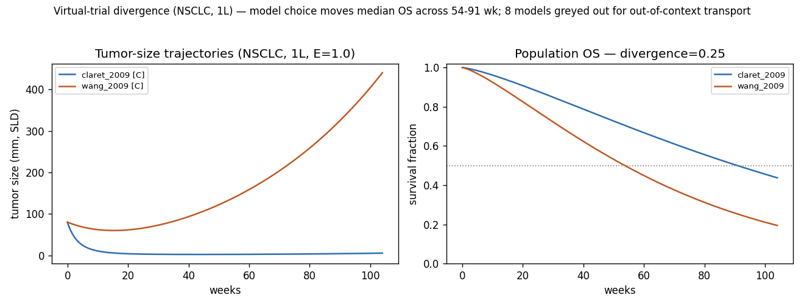

# Onkos

**See how much an oncology forecast depends on the model behind it.**

Onkos is an open Python toolkit and citation-backed dataset for tumor-growth-inhibition
(TGI) modeling. It connects drug exposure, tumor dynamics, and population survival, then
compares plausible published models side by side.

The goal is not to produce one confident number. It is to show when equally defensible
modeling choices produce different answers.

[](https://github.com/clay-good/onkos/actions/workflows/ci.yml)
v0.41 · Python 3.9+ · Code: MIT · Data: CC BY 4.0



## Why use Onkos?

Early oncology decisions often depend on a chain of assumptions:

**exposure → tumor response → surrogate metric → survival**

Published models can fit early data similarly yet imply very different long-term outcomes.
Those differences are easy to hide inside separate papers, codebases, and file formats.

Onkos puts them in one testable workflow. It helps you:

- compare eligible TGI and survival models in the same tumor context;
- measure uncertainty from parameters separately from uncertainty caused by model choice;
- expose assumptions about resistance, growth laws, response metrics, and survival links;
- reject or downgrade models used outside their validated context;
- identify which uncertain parameter or structural choice matters most;
- export models to NONMEM, SBML, PharmML, nlmixr2/rxode2, Pumas, JSON-LD, and COMBINE archives.

This turns “the result depends on the model” from a disclaimer into a measurable result.

## What it does

Onkos ships a curated dataset, simulation kernels, and analysis tools for:

- population tumor-size, OS, and PFS simulation;
- virtual-trial comparison and model averaging;
- parameter uncertainty and sensitivity analysis;
- model-selection variance budgets;
- RECIST response, ORR, duration of response, and two routes to PFS;
- practical identifiability, D-optimal sampling, and model discriminability;
- combination, resistance, exposure-response, and surrogate-timing analyses;
- a model-selection atlas that surveys the important assumptions for a context.

Every record carries its source, derivation context, transportability limits, confidence
tier, and review status. Confidence propagates through analyses, so a polished plot cannot
silently become more trustworthy than its weakest input.

## Quick start

```bash
git clone https://github.com/clay-good/onkos.git
cd onkos
python3 -m venv .venv
source .venv/bin/activate
pip install -e .

onkos validate
onkos info
onkos simulate --compare
onkos atlas --tumor-type NSCLC --line first
```

Use the dashboard for an interactive view:

```bash
pip install -e ".[dashboard]"
streamlit run dashboard/app.py
```

Or work from Python:

```python
import onkos

dataset = onkos.load()
context = {"tumor_type": "NSCLC", "line": "first"}

comparison = onkos.compare(
    dataset,
    purpose="tgi",
    context=context,
    drug_effect=1.0,
)

print(comparison.median_os_range)
print(comparison.os_divergence)
print(comparison.excluded)

budget = onkos.model_selection_budget(
    dataset,
    context=context,
    endpoint="OS",
)

print(budget.fractions)
print(budget.dominant)
```

See `onkos --help` for the full CLI. The tested notebooks in [`notebooks/`](notebooks/)
walk through each analysis, and [`docs/dataset-health.md`](docs/dataset-health.md) reports
the current evidence and verification state.

## What Onkos does not do

Onkos is for drug-development research, simulation, and education. It is not a clinical
decision tool, prognostic calculator, treatment recommender, or source of individual
patient predictions.

The project is alpha software. Some parameter values remain illustrative or await human
verification against the cited source. Their `review_status` makes that limitation
machine-readable instead of burying it in a footnote.

## Trust and reproducibility

Onkos checks more than whether code runs:

- JSON Schema and referential-integrity validation protect the dataset.
- Scientific landmark tests verify that each kernel reproduces the defining behavior of
  the published model.
- Round-trip tests check that exported equations and parameters still match the Python
  reference implementation.
- Deterministic metadata makes repeated COMBINE archive exports byte-for-byte reproducible.
- Tier audits flag confidence claims that exceed their evidence.
- Out-of-context use produces explicit exclusions, downgrades, and warnings.

For the validation approach, see [`docs/validation-landmarks.md`](docs/validation-landmarks.md).
For contribution and record-review rules, see [`CONTRIBUTING.md`](CONTRIBUTING.md).

## License and citation

Code is [MIT licensed](LICENSE). The dataset is licensed under
[CC BY 4.0](LICENSE-DATASET). If you use a record, cite Onkos through
[`CITATION.cff`](CITATION.cff) and cite the original source stored in that record.
