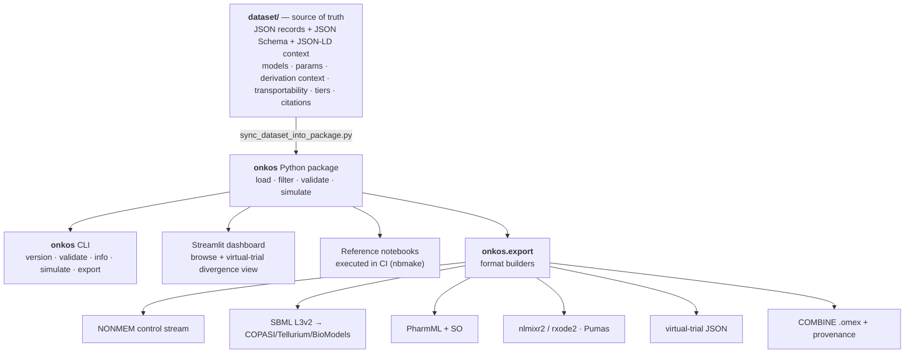
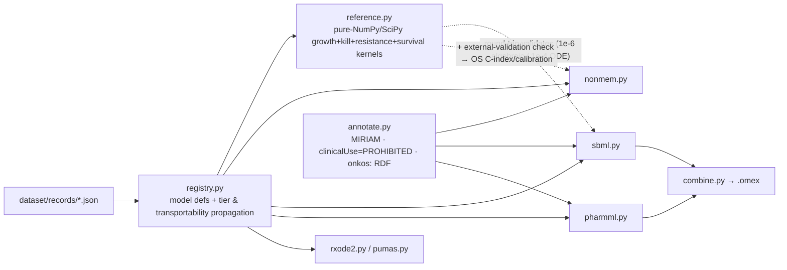

# Onkos — design spec (v0.1)

**A curated, citation-backed dataset of tumor-growth and tumor-growth-inhibition (TGI) model parameters and the exposure-response → survival linkage that oncology drug development runs on — annotated with explicit confidence tiers, derivation context, and transportability, and exportable into the standard pharmacometric and systems-biology formats (NONMEM, SBML, PharmML, nlmixr2/rxode2, Pumas).**

> *Onkos* (Greek *ὄγκος*, "mass, bulk, swelling") — the literal root of *onco-* and *oncology*. The same kind of pun as its siblings: a piece of Greek that also happens to be the exact technical root of the field it serves.

> **Naming is provisional — check PyPI and GitHub before committing.** Backups, with reasoning:
> - **Karkinos** (Greek *καρκίνος*, "crab") — the most *complete* double-pun of the three projects: it is simultaneously the mythological crab (the constellation Cancer; the crab that pinched Heracles during the Hydra fight) **and** the literal word Hippocrates used for the disease, the root of *cancer* and *carcinoma*. Thematically perfect; slightly heavier in tone; check collisions.
> - **Hydra** — the most apt to the dataset's *load-bearing idea*: cut one head and two grow back, which is precisely the regrowth/resistance dynamic (the λ term, §4–5) that is the central modeling challenge in oncology. But "Hydra" is heavily used as a software name — collision risk is high.
>
> I'd lead with `onkos` (cleanest root, lowest collision) and keep `karkinos` as the romantic alternate.

This is the third in a family with **Nidus** (gestational physiology) and **Hypnos** (anesthetic PK/PD). It reuses their architecture, their tier philosophy, and their "infrastructure not simulator; honest about uncertainty by default" stance — and it is **composable** with Hypnos: a Hypnos-style PK record for an anticancer drug feeds an Onkos TGI model, giving a full PK → exposure → tumor-dynamics → survival chain in one open, tier-annotated toolchain. Where Onkos differs, it's because oncology modeling has a specific, high-stakes failure mode of its own — models fit to one trial/tumor/drug get silently transported to another — and because the chain ends not in a concentration but in a **survival prediction that gates billion-dollar go/no-go decisions.**

---

## 1. The problem this dataset solves

Drug attrition in oncology is higher than in any other therapeutic area, and the field's response has been **model-informed drug development**: build quantitative models that link drug exposure to tumor-size dynamics, and tumor-size dynamics to overall survival (OS) and progression-free survival (PFS), so that early-phase data can forecast late-phase outcomes and inform dose selection and go/no-go decisions.

The workhorses of this enterprise are a small set of **tumor-growth-inhibition (TGI) models** — Gompertz/logistic/exponential growth laws, the Simeoni preclinical model, the Claret clinical model, the Stein/Bruno growth-rate-constant framework, Norton-Simon kill kinetics — each parameterized by a growth rate, a drug-induced kill rate, and a resistance/regrowth term, then linked to survival through TGI-derived metrics (tumor growth rate constant, tumor shrinkage rate, time-to-growth, depth and duration of response, week-8 change).

These models and their parameters:

- live in per-drug, per-trial, per-tumor-type papers, mostly in `CPT: Pharmacometrics & Systems Pharmacology` and similar, much of it paywalled;
- carry **enormous, often under-communicated uncertainty** — resistance and kill-rate terms with coefficients of variation near 90% are routine, because resistance is poorly identifiable from short trials;
- are derived in **one specific context** (a single drug, a single tumor type, a single line of therapy, a single trial) and then **transported** — often without comment — to other drugs, tumor types, and lines, where their predictive validity is unknown;
- get re-typed, and quietly mis-typed, into the next analysis's control stream.

The field has the adjacent layers: **open methods** (the models are published) and **review articles** (e.g., comprehensive reviews of tumor-dynamics and resistance models). What it lacks is the curated layer between them — a tier-annotated, context-aware, machine-readable dataset that says, honestly, *which TGI model and which parameters, for which tumor type and line, derived from which trial, validated how far beyond it, with what confidence, and how much the survival prediction changes if you'd picked a different model.*

**Onkos is that layer** — curated once, citation-backed, tier-annotated, transportability-aware, machine-readable, and exported into the formats pharmacometricians and systems-biology modelers already run. It is the smallest piece of infrastructure that could make oncology TGI modeling **honest about model-and-context-selection uncertainty by default.**

### Why this is the right project (and why this scope)

"Cancer" is thousands of diseases; "cure cancer" is not a dataset. But the **TGI → exposure-response → survival chain** is a single, well-defined, standardized modeling sub-field that is (1) the most reused machinery in oncology pharmacometrics, (2) scattered and paywalled, (3) saturated with first-class-worthy uncertainty, (4) gated to standard formats (NONMEM/SBML/PharmML), (5) genuinely safe for a solo open-source builder — it is drug-development *methodology*, with no wet lab and no clinical deployment — and (6) **underbuilt**: the epidemiological-parameter equivalent (Epiverse's `epiparameter`/`epireview`) already exists and is mature; the oncology equivalent does not. This is the scoping discipline Nidus applied ("normal physiology, human, 8–40w singleton") and Hypnos applied ("published population PK/PD models").

---

## 2. Scope — the declared envelope

Onkos covers **published tumor-growth and tumor-growth-inhibition models, the exposure-response link that drives them, the TGI-derived metrics, and the TGI-metric → survival models**, for solid-tumor oncology drug-development modeling in humans (with a clearly separated preclinical-translation subsystem).

**In scope**

- Unperturbed tumor-growth laws (exponential, logistic, Gompertz, Simeoni exponential→linear, von Bertalanffy/power-law) and their rate/capacity parameters.
- Drug-effect / kill models (log-kill, Norton-Simon, signal-distribution transit compartments) and their potency/delay parameters.
- Resistance / regrowth models (resistance-emergence rate, resistant fraction) — the λ "Hydra" term.
- Exposure-response links mapping PK exposure metrics (C_avg, AUC, C_max) to the kill rate (Emax/power parameterizations).
- TGI-derived metrics (tumor growth rate constant *k_g*, shrinkage rate *k_s*, time-to-growth, tumor shrinkage rate, depth/duration of response).
- TGI-metric → survival models (Cox and parametric OS/PFS link models) and their hazard parameters and link functions.
- Tumor-type / line-of-therapy baseline growth and response parameters (the "physiological constants" of each tumor context).
- A separated **preclinical-translation** subsystem (xenograft growth parameters; in-vitro potency → in-vivo efficacy translation).

**Out of scope (declared exclusions)**

- Any per-patient prognosis, survival estimate framed as a prediction for a real person, treatment recommendation, or clinical decision support. *(See §10. Hard line, not a roadmap item.)*
- Mechanistic intracellular signaling / multi-omics network models (a different field with its own infrastructure; Onkos stays at the tumor-dynamics scale).
- Hematologic malignancies' specialized dynamics in v0.x (the solid-tumor RECIST-style size framework is the initial envelope; liquid tumors are a later, explicitly enumerated extension).
- Radiotherapy and surgery dynamics beyond what a published TGI model encodes.
- Immuno-oncology mechanistic parameters ship only as a **hypothesis-tier** subsystem with non-predictive labeling (§3, §10) — the quantitative validation simply isn't there yet to do otherwise honestly.

---

## 3. Subsystems

The Nidus "subsystems" and Hypnos "drug-class families" map here onto the **layers of the TGI modeling stack plus the tumor-context library.**

| Subsystem | What it covers | Canonical sources (illustrative) |
| --- | --- | --- |
| `growth_laws` | Unperturbed tumor-growth functions + rate/capacity params | Gompertz; logistic; Simeoni 2004 (exp→linear) |
| `drug_effect` | Kill/inhibition models, signal-distribution transit delay | Simeoni 2004; Norton-Simon |
| `resistance` | Regrowth/resistance emergence (the λ term) | Claret 2009; tumor-dynamics/resistance reviews |
| `exposure_response` | PK-exposure → kill-rate link (Emax/power) | drug-specific ER analyses |
| `tgi_metrics` | Derived metrics: *k_g*, *k_s*, TGR, TSR, time-to-growth, depth/duration of response | Stein/Bruno growth-rate-constant framework |
| `survival_link` | TGI-metric → OS/PFS (Cox & parametric) hazard params, link functions | model-based OS prediction analyses |
| `tumor_type_baselines` | Baseline growth & response by tumor type and line of therapy | per-indication TGI fits (NSCLC, breast, CRC, HCC, melanoma…) |
| `preclinical_translation` | Xenograft growth params; in-vitro → in-vivo potency translation | Simeoni 2004; in-vitro/in-vivo growth-rate models |
| `immuno_oncology` ⚠️ | Tumor–immune QSP params (**hypothesis-tier, not for prediction**) | IO QSP platforms (qualitative shape only) |

Each subsystem record stores, at minimum, the model/parameter, its parameterization convention, its unit system, and its membership.

---

## 4. The record — the unit of curation

As in Hypnos, a record is a *structured object*, not a scalar — but Onkos records come in two complementary kinds, sharing one schema:

- a **model record** (e.g., "Claret 2009 clinical TGI model") — structure + parameters + derivation context + tier;
- a **context-baseline record** (e.g., "NSCLC second-line baseline tumor growth rate constant") — a parameter with its tumor type, line, and trial provenance.

```jsonc
{
  "id": "resistance.claret_2009.tgi",
  "kind": "model",                          // model | context_baseline
  "purpose": "tgi",                         // growth | drug_effect | tgi | exposure_response | metric | survival_link | translation
  "structure": {
    "growth_law": "exponential",
    "kill_model": "first_order_exposure_driven",
    "resistance": "exponential_decay_of_kill", // the λ term
    "states": ["tumor_size"]
  },
  "parameters": [
    { "symbol": "kL", "label": "tumor growth rate constant",
      "value": { "central": 0.0012, "low": null, "high": null, "units": "1/week" },
      "iiv_cv_percent": null, "tier": "B",
      "primary_citation": "claret-2009-tgi",
      "extraction": { "review_status": "unverified", "source_locator": "Table 2",
                      "tier_rationale": "Established model form; this rate is drug/indication-specific." } },
    { "symbol": "kD", "label": "drug-induced kill rate",
      "value": { "central": 1.0, "low": null, "high": null, "units": "1/week per (ug/L)^theta" },
      "iiv_cv_percent": 89,                 // uncertainty made first-class
      "tier": "C", "primary_citation": "fostvedt-2022-dacomitinib" },
    { "symbol": "lambda", "label": "resistance / regrowth rate",
      "value": { "central": 14.47, "low": null, "high": null, "units": "1/week" },
      "iiv_cv_percent": 96, "tier": "C", "primary_citation": "fostvedt-2022-dacomitinib" }
  ],
  "derivation_context": {                   // the load-bearing oncology field
    "drug": "dacomitinib", "drug_class": "EGFR_TKI",
    "tumor_type": "NSCLC", "line_of_therapy": "first",
    "trial": "ARCHER-1050 (illustrative)", "n_patients": 266,
    "measurement": "RECIST_sum_longest_diameters"
  },
  "transportability": {                     // how far beyond its origin is it validated?
    "validated_tumor_types": ["NSCLC"],
    "validated_drug_classes": ["EGFR_TKI"],
    "out_of_context_action": "tier_down_to_D and warn"
  },
  "known_failure_modes": [
    { "condition": "resistance term applied to a non-resistance-driven regimen",
      "behavior": "lambda unidentifiable; survival link unstable",
      "action": "tier_down_to_D and warn", "citation": "..." }
  ],
  "predictive_performance": [               // here: did the TGI→OS link hold out-of-sample?
    { "metric": "OS_C_index_external", "value": 0.62, "population": "independent NSCLC cohort",
      "citation": "..." }
  ],
  "tier": "C",                              // record-level tier = worst contributing tier
  "primary_citation": "claret-2009-tgi"
}
```

The fields that carry the project, the analog of Nidus's per-parameter tier and Hypnos's applicability envelope:

- **`derivation_context`** — the exact drug, tumor type, line, trial, and measurement basis a model/parameter came from. Machine-readable, mandatory.
- **`transportability`** — how far beyond that origin the parameter has actually been validated. The dominant silent error in oncology modeling is applying a context-specific fit out of context; Onkos makes that move *visible* and forces a tier penalty when a simulation crosses the validated boundary.
- **`iiv_cv_percent`** — inter-individual variability on the high-uncertainty terms (kill, resistance), surfaced so that a parameter "known" to 90% CV cannot masquerade as a point estimate.

---

## 5. Confidence tiers (adapted for TGI / survival linkage)

Same A/B/C/D spine; re-specified for tumor-dynamics and survival models. As in Hypnos, tier assignment is partly *numeric* — oncology has a standard out-of-sample question ("did the TGI-metric → OS link hold in an independent trial?") with concrete metrics (external C-index / calibration; predicted-vs-observed OS hazard ratios).

| Tier | Meaning |
| --- | --- |
| **A** | Model form and parameters externally validated: the TGI→survival link held in ≥1 *independent* trial with acceptable discrimination/calibration; consistent across studies; broad context. |
| **B** | One robust model from a well-powered trial, with at least a partial external check; parameters reasonably identified. |
| **C** | Single trial, narrow tumor type/line; no external validation; high-CV kill/resistance terms (poorly identified). |
| **D** | Transported outside its validated context (different tumor type, line, or drug class), **or** hypothesis-tier (immuno-oncology mechanistic params with no quantitative validation). **Not predictive.** |

**Tier propagation — "worst input wins," as in both siblings.** A full virtual-trial simulation composes a *growth law* + *drug effect* + *resistance* + *exposure-response* + *survival link* (+ optionally a *tumor-type baseline*). The composed prediction inherits the **worst** tier among its components, and that propagated tier is written into every export as RDF (`onkos:confidenceTier`).

**Out-of-context transport forces a tier floor.** If a simulation applies a record outside its `transportability` envelope or trips a `known_failure_mode`, the result is **auto-tiered to D** with an attached warning. You cannot get an A-looking survival forecast from a model validated only on a different tumor type.

---

## 6. Reference kernels & the simulator boundary

Every model binds to a **pure-NumPy/SciPy reference kernel**, against which all format exports are round-trip validated (algebraic ≈ 1e-6, ODE ≈ 1e-4 relative — same discipline as Nidus/Hypnos). Kernels implement exactly:

- the growth-law ODEs (exponential, logistic, Gompertz, Simeoni exp→linear);
- the exposure-driven kill term and the signal-distribution transit chain (delayed cell death);
- the resistance/regrowth (λ) dynamics;
- the exposure-response transform (Emax/power);
- the TGI-metric extraction (*k_g*, *k_s*, TSR, time-to-growth, depth/duration of response);
- the TGI-metric → hazard → survival-curve computation (parametric/Cox-form survival simulation at the **trial/population** level).

**Onkos is NOT a prognostic engine and NOT a treatment optimizer.** It simulates tumor-size and population-survival *trajectories* for research, model comparison, and export validation. It does not output a survival estimate for an individual, and it does not recommend or rank therapies. The dashboard's headline feature is built entirely on forward, population-level simulation:

> **Virtual-trial divergence view.** Pick a tumor type, line, and a drug-effect size (or an exposure profile, optionally piped from a Hypnos PK record); Onkos overlays the simulated tumor-size trajectories and the resulting **population OS/PFS curves** across *every eligible TGI model*, greys out the ones whose `transportability` envelope the chosen context violates (with the reason), and reports the quantitative divergence in the survival prediction. This makes **model-selection risk in go/no-go decisions measurable** — the exact risk that, unquantified, sends drugs into doomed phase-3 trials. It is the Onkos analog of Nidus's tier-distribution figure and Hypnos's model-divergence view: the dataset being honest about itself.

---

## 7. Export formats — the interop layer (shared with Hypnos)

Deliberately the same pharmacometric + systems-biology stack as Hypnos, so the two compose and a downstream user learns one toolchain.

| Format | Role | Sibling analog |
| --- | --- | --- |
| **NONMEM** control stream | TGI and survival-link models are overwhelmingly NONMEM-fit; the format pharmacometricians read first. | Hypnos NONMEM |
| **SBML** (L3v2) | TGI models are growth+kill+resistance ODE systems → COPASI/Tellurium, BioModels, and continuity with Nidus. | Nidus/Hypnos SBML |
| **PharmML** (+ **SO**) | The standardized pharmacometric markup — the durable interop anchor. | Hypnos PharmML |
| **nlmixr2 / rxode2** (R), **Pumas** (Julia) | Open-source simulation/estimation. | Hypnos R/Julia |
| **virtual-trial JSON** | Parameters + tumor context + survival link + the mandatory **NOT FOR CLINICAL USE** flag, for simulator/dashboard ingestion. | Hypnos TCI-sim JSON |
| **CSV / BibTeX** | Flat parameter + citation export. | Nidus/Hypnos |
| **COMBINE `.omex`** | Bundles SBML + PharmML + SO + provenance. | Nidus/Hypnos `.omex` |

**Exports are generated, never hand-edited** (CI regenerates on every push), and each carries: a `onkos:datasetVersion` pin for reproducibility; the propagated tier and any transportability/failure-mode warnings as MIRIAM-style RDF (with `bqbiol:isDescribedBy` DOI/PMID links surviving even if a tool strips the custom `onkos:` predicates); and a universal, machine-readable **`onkos:clinicalUse = "PROHIBITED — research / drug-development / education only"`** annotation on every exported model.

---

## 8. Architecture

The **dataset is the single source of truth**; everything else is a deterministic projection — identical philosophy to Nidus and Hypnos.





**Design decisions and why (the family table, ported):**

| Decision | Rationale |
| --- | --- |
| **Pure Python** (NumPy/SciPy); R/Julia only as export targets | Nothing is compute-bound; the R/Julia models are generated artifacts, not runtime deps. |
| **Dataset is the centerpiece; everything else is a presentation layer** | The durable contribution is the curated, tiered, context-annotated parameters. |
| **`derivation_context` + `transportability` are first-class** | The dominant silent error in oncology modeling is out-of-context transport; making it machine-enforced is the load-bearing idea, as confidence tiers are for Nidus and envelopes for Hypnos. |
| **Uncertainty (IIV CV) on kill/resistance is surfaced** | A resistance term known only to ~90% CV must not present as a point estimate. |
| **Tiers + transport warnings propagate; worst input wins** | A survival forecast is only as trustworthy as its least-validated component or furthest extrapolation. |
| **Population-level forward simulation only; never per-patient prognosis or therapy ranking** | The line between "drug-development research tool" and "clinical prognostic/decision tool" is exactly individual prediction and recommendation. Onkos stays on the safe side by construction. |
| **Composable with Hypnos** | A shared export/annotation convention lets a Hypnos PK record drive an Onkos TGI model end to end. |

---

## 9. Validation & verification workflow

**Round-trip validation** (CI): every exported NONMEM/SBML/PharmML model is re-simulated and checked against the pure-Python reference kernel within tolerance — an export bug cannot ship silently.

**Literature / external validation** (where the source supports it): kernel output is compared against published example simulations or digitized tumor-size and survival curves; where an independent-cohort validation of the TGI→OS link exists, its discrimination/calibration is recorded in `predictive_performance` and feeds tier assignment.

**Human verification** (the gate on `verified`): a contributor opens the source PDF and confirms, field by field, (1) the model structure and parameterization, (2) every parameter value *and its units and the exact form of the resistance/exposure-response terms* (where transcription errors hide), (3) the derivation context (drug, tumor type, line, trial, n, measurement basis), and (4) the validated transportability boundary. Only then does `review_status` move from `unverified` to `verified`. LLMs assist but never promote on their own authority; the verified count is reported honestly.

**The single highest-leverage contribution**, as in both siblings: promoting `unverified` records to `verified` by reading the source PDF — with the oncology-specific twist that the **derivation context and transportability claims** are the part most worth scrutiny, because that's where over-broad reuse originates.

---

## 10. Safety & scope guardrails (non-negotiable)

Onkos's danger is different in shape from Hypnos's. Hypnos could be misused to dose a real patient; Onkos could be misread as *"this drug will shrink my tumor"* or *"this is my prognosis."* The guardrails target that:

- **NOT a clinical decision tool. NOT a prognostic calculator. NOT a treatment recommender or therapy-ranking system. NOT validated for any decision affecting a real patient.** For drug-development methodology, simulation, and education only.
- **No individual-level output.** Simulation is population/trial-level. Onkos will not emit a survival estimate, response probability, or treatment ranking for an individual. The virtual-trial view is explicitly framed as *"how do published models disagree at the trial level?"* — never *"your tumor / your survival / your best option."*
- **No claim of drug efficacy.** Parameters are descriptive of published *model fits*, with all attached uncertainty (IIV CV, tier, transportability). Onkos reports what a model said about a trial, not what a drug will do for a person.
- **Every export carries `clinicalUse = "PROHIBITED — research / drug-development / education only"`** — universal, human- and machine-readable.
- **The `immuno_oncology` subsystem ships hypothesis-tier**, with a "DO NOT USE FOR PREDICTION" annotation (exactly Nidus's Phase-C convention), because the quantitative validation to do otherwise honestly does not yet exist.
- Like its siblings: not exhaustive, not a replacement for a modeler's judgment, not an automated researcher.

The tell that the project has crossed its line: any feature that takes a real patient's tumor measurement and returns a prognosis or a therapy choice. That feature does not get built.

---

## 11. Phased roadmap

| Phase | Content | Done = |
| --- | --- | --- |
| **A — TGI spine** | Growth laws + the Claret clinical TGI model + one tumor context (NSCLC, first line) end to end, with the TGI→OS survival link and the virtual-trial divergence view; NONMEM + SBML export; round-trip validation. | The canonical clinical TGI model works end to end and divergence is visible. |
| **B — Resistance + exposure-response** | Resistance (λ) and exposure-response across a handful of drugs/tumor types; PharmML + rxode2/Pumas export; IIV-CV surfacing. | The kill/resistance/ER machinery is in, with uncertainty made first-class. |
| **C — Survival + baselines** | Breadth of TGI-metric → survival models; the `tumor_type_baselines` library (NSCLC, breast, CRC, HCC, melanoma…, by line). | The context library that makes the divergence view broadly useful exists. |
| **D — Preclinical translation** | Simeoni preclinical model; xenograft params; in-vitro → in-vivo potency translation. | The discovery-to-clinic bridge is in. |
| **E — Immuno-oncology (hypothesis-tier)** | Tumor–immune QSP params, shipped non-predictive with explicit warnings. | The frontier is represented honestly, not as if it were validated. |
| **F — Hardening** | External-validation backfill; COMBINE `.omex`; Zenodo DOI; CITATION.cff. | Citable, reproducible, releasable. |

Phase A alone is a self-contained, genuinely useful release: an open, validated, tier-annotated Claret-model + NSCLC + survival-link with a virtual-trial divergence view is something nobody ships openly today and that teams re-implement by hand for every program.

---

## 12. Repository layout

```
onkos/
├── README.md
├── LICENSE                      # MIT (code)
├── LICENSE-DATASET              # CC-BY-4.0 (data)
├── CITATION.cff
├── CONTRIBUTING.md              # tier system, transportability rules, PDF-verification checklist
├── dataset/
│   ├── schema/                  # JSON Schema + JSON-LD context
│   ├── records/                 # one JSON per model / context-baseline (source of truth)
│   └── citations/               # Crossref/PubMed-verified citation records
├── python/
│   └── onkos/
│       ├── load.py · filter.py · validate.py
│       ├── simulate.py          # population-level forward simulation (no individual prognosis)
│       └── export/
│           ├── registry.py · reference.py
│           ├── nonmem.py · sbml.py · pharmml.py · rxode2.py · pumas.py
│           ├── virtual_trial_json.py · combine.py · annotate.py
├── dashboard/                   # Streamlit: browse + virtual-trial divergence view
├── notebooks/                   # executed in CI (nbmake), incl. divergence figure
└── docs/
    ├── about/essay.md           # "why model-and-context-selection risk is the load-bearing idea"
    └── specs/v0.1/              # this document and siblings
```

---

## 13. Cheat sheet (target API)

```python
import onkos
ds = onkos.load()

m = ds["resistance.claret_2009.tgi"]
m.tier                                    # "C"
m.derivation_context.tumor_type           # "NSCLC"
m.transportability.validated_tumor_types  # ["NSCLC"]
m["lambda"].iiv_cv_percent                # 96  -> uncertainty is first-class
m.extraction.review_status                # "verified" | "unverified" | "contested"
m.primary_citation.doi

# Population-level forward simulation (NO individual prognosis, NO therapy ranking)
import numpy as np
from onkos.simulate import simulate
ctx = dict(tumor_type="NSCLC", line="first")
traj = simulate(ds, "resistance.claret_2009.tgi",
                context=ctx, drug_effect=1.0, t=np.linspace(0, 104, 209))  # weeks
traj.tumor_size, traj.os_curve            # tumor-size + population OS trajectory
traj.tier, traj.warnings                  # propagated tier + transport/failure-mode warnings

# Virtual-trial comparison — the headline feature
cmp = onkos.compare(ds, purpose="tgi_survival", context=ctx, drug_effect=1.0)
cmp.os_divergence                         # how much the survival prediction depends on model choice
cmp.excluded                              # models greyed out for out-of-context transport, with reasons
```

```bash
onkos version
onkos validate                                  # JSON-Schema-validate the dataset
onkos info                                       # counts by subsystem / tier / review status
onkos export --format nonmem   --output exports/nonmem/
onkos export --format sbml     --output exports/sbml/
onkos export --format pharmml  --output exports/pharmml/
onkos export --format omex     --output exports/onkos.omex
streamlit run dashboard/app.py
```

---

## 14. Relationship to Nidus and Hypnos

The three are one body of work with one thesis: **a model is only as trustworthy as its weakest, least-validated input, so make that fact a first-class, machine-readable field.**

- **Nidus** — gestational physiology; load-bearing idea = the per-parameter **confidence tier**.
- **Hypnos** — anesthetic PK/PD; load-bearing idea = the **applicability envelope** (and known failure modes).
- **Onkos** — oncology TGI/survival; load-bearing idea = **derivation context + transportability** (and surfaced IIV uncertainty).

They share architecture (dataset-as-source-of-truth → package → CLI/dashboard/exports; registry → reference kernels + format builders + round-trip validation), license posture (MIT code, CC-BY-4.0 data), citation posture (Zenodo DOI + per-parameter primary source), and a hard "infrastructure, not a clinical tool" boundary. Hypnos and Onkos additionally **compose**: an anticancer drug's PK (Hypnos-style) can drive the exposure-response of an Onkos TGI model, giving an open, tier-annotated PK → exposure → tumor-dynamics → survival chain.

---

## 15. Licensing & citation

- **Code:** MIT.
- **Dataset:** CC-BY-4.0 — each record is data; attribution required, no other restriction.
- **Citation:** Zenodo concept DOI on first release; `CITATION.cff` for machine-readable metadata. Every record exposes its own primary-source DOI via `record.primary_citation.doi` — when you use one record, cite Onkos **and** the original source.

---

## 16. One-paragraph pitch (for the README top / Zenodo abstract)

> Onkos is a curated, citation-backed, machine-readable dataset of the tumor-growth-inhibition models, exposure-response links, and TGI-metric → survival models that oncology drug development depends on. Every record carries an explicit confidence tier, its derivation context (drug, tumor type, line, trial), its validated transportability boundary, the inter-individual variability on its high-uncertainty terms, and its external-validation performance — and exports cleanly into NONMEM, SBML, PharmML, nlmixr2/rxode2, and Pumas. It is not a prognostic tool and not a treatment recommender; it is the honest, reusable ground-truth layer beneath model-informed oncology drug development, designed to make model-and-context-selection uncertainty visible by default. It is the sibling of Nidus and Hypnos, built on the same principle: a model is only as trustworthy as its weakest, least-validated input — so make that a first-class, machine-readable field.
